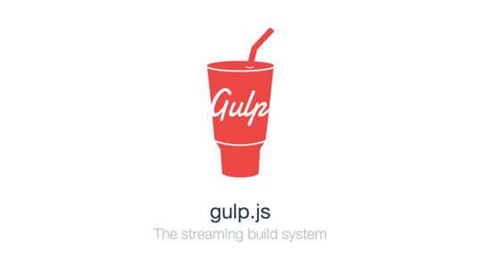
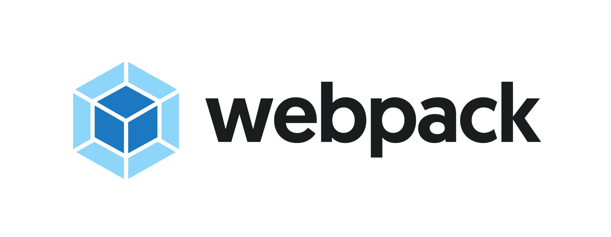

### #01. フロントエンド開発環境

<a href="../">戻る</a>

---

#### もくじ

- nodenv, node
- npm
- 開発環境テンプレート(gurunavi creators)
- ビルドツール
- HTML（テンプレートエンジン）
- CSS（Sass）
- 自動リロード

---

### nodenv, node

  - nodeとは
  - インストール
  - バージョンの設定

--
<div class="-mt-80 -mb48">
  <h4>nodenv, node</h4>
  <ul>
    <li>nodeとは</li>
  </ul>
  
</div>
<p>フロントエンドの環境構築のために, nodeをインストールしますが、<br>何者なのか？</p>
<div class="-mt8 fragment">
  <p class="-big"><span class="-b">Node.js本体</span>です</p>
  <p>また、nodenvは、Node.jsのバージョン管理ツールです。</p>
  <p><span class="-b">フロントエンドの環境はNode.jsによって動いている</span>と覚えておいてください。</p>
</div>

--

<div class="-mt-80 -mb48">
  <h4>nodenv, node</h4>
  <ul>
    <li>インストール</li>
  </ul>
</div>

<p>早速ですが、nodeをインストールしていきましょう。<br>まずは、nodeのバージョン管理を行うnodenvから</p>

・nodenvをインストール
```shell
$ brew install nodenv
```
<br>
・インストールできるnodeのバージョン一覧を表示
```shell
$ nodenv install --list
```
<br>
・version9.8.0のnodeをインストール
```shell
$ nodenv install 9.8.0
```
<br>
・再読み込み
```shell
$ nodenv rehash
```

--

### nodenv, node
- バージョンの設定

一応、インストールできていることとバージョンの確認
9.8.0が有効になっていると思います。
```shell
$ nodenv versions
```
<br>
バージョンアップしてみましょう
```shell
$ nodenv install 9.9.0
```
<br>
まだ9.8.0が有効のままですね
```shell
$ nodenv versions
```
<br>
9.9.0を指定
```shell
$ nodenv global 9.9.0
```
<br>
バージョンアップ完了!!
```shell
$ nodenv versions
```

-- 

### nodenv, node
- バージョンの設定


<p class="-mt36">Mac全体でv9.9.0を使用することになります。</p>
```shell
$ nodenv global 9.9.0
```

<p class="-mt12">カレントディレクトリに .node-version というファイルが作成されます。<br>
localの方が優先されます。</p>
```shell
$ nodenv local 9.9.0
```


---

### npm

  - npmとは
  - html, css, jsをそのまま開発しない
  - npmの初め方
  - package.json
  - package-lock.json

--

<div class="-mt-80 -mb48">
  <h4>npm</h4>
  
  <ul>
    <li>npmとは</li>
  </ul>
</div>

<p><span class="-b">Node Package Manager</span> の略でNode.jsのモジュールを管理するツールです。</p>
<p class="-mt24 fragment">Q. managerが必要なほど、モジュール入れるんですか？</p>
<p class="fragment">A. はい、相当数のモジュールを入れることになります。</p>
--

<div class="-mt-80 -mb48">
  <h4>npm</h4>
  <ul>
    <li>html, css, jsをそのまま開発しない</li>
  </ul>
</div>

<p>背景： プロジェクトの大規模化によって、効率よくチーム開発していく必要があります</p>
<p class="-ex-small fragment">ちなみに検索のHTMLはspだけで 約2000行 × 20ファイル以上あります...</p>

<p class="-mt24">PHPのSmartyのように、HTMLにもテンプレートエンジンがあり、モジュール単位で管理しています。css, jsも同様です。</p>


<p class="-mt12">また、こんなことも...</p>

<ul class="fragment">
  <li>変更したらすぐにビルドして、ブラウザを読み込み直す</li>
  <li>未来の記法で実装できるように</li>
  <li>ファイルの圧縮(不要な記述の削除など)</li>
</ul>

-- 

<div class="-mt-80 -mb48">
  <h4>npm</h4>
  <ul>
    <li>npmの初め方</li>
  </ul>
</div>

実は、npmが既にインストールされています。
```shell
$ npm -v
```
npmのバージョン情報が出力されたと思います。<br>nodeのインストールとともにnpmもインストールされます。

<p class="-mt36">お好きな場所でnpm開始宣言をお願いします。<span class="-ex-small">(動作確認後、生成されたファイル等は使用しません。削除しやすい場所でお願い致します。)</span><br>
対話形式で設定項目について質問されますが、全てデフォルトで問題ありません。</p>
```shell
$ npm init
```
package.jsonが生成されたと思います。

--

<div class="-mt-80 -mb48">
  <h4>npm</h4>
  <ul>
    <li>package.json</li>
  </ul>
</div>

package.jsonとは
- npm moduleの依存関係を記したjsonファイル

役割
- チーム内の開発環境の統一

<br>
下記のコマンドを打つと、moduleが追加され、package.jsonにmodule名とバージョンが記載されます
```shell
npm i autoprefixer
```

<p class="-mt12">git等で、package.jsonを含む環境を共有してもらったら、下記のコマンドでmodule一覧をインストールできます。</p>
```shell
npm i
```

-- 
<div class="-mt-80 -mb48">
  <h4>npm</h4>
  <ul>
    <li>package.json</li>
  </ul>
</div>

package.jsonのscriptsに記載したものは、コマンドとして実行できます。
```json
{
  "name": "projectName",
  "~~": "",
  "scripts": {"test": "echo \"Error: no test specified\" && exit 1"}
}
```
<br>
```shell
$ npm run test
```
<p class="-mt24">ターミナルに上記のエラーが出力されているかと思います。</p>
<p></p>

-- 

<div class="-mt-80 -mb48">
  <h4>npm</h4>
  <ul>
    <li>package.json</li>
  </ul>
</div>

<p>ぐるなびのテンプレートを使用して、フロントエンドのビルドを実際にお試しいただきたいと思います。</p><br>
<ul>
  <li>git clone https://github.com/gurunavi-creators/gnavi-npm-scripts-boiler-pug.git</li>
  <li>npm i</li>
  <li>npm run build</li>
  <li>npm run watch</li>
</ul>

--

<div class="-mt-80 -mb48">
  <h4>npm</h4>
  <ul>
    <li>ちなみにpackage-lock.jsonは...</li>
  </ul>
</div>

<p>npmモジュールのバージョン固定のため生成されます。<br>
package-lock.jsonもチーム内で共有することで、より環境の固定化ができます。</p>

---

### 開発環境テンプレート<br>(gurunavi creators)

  - gnavi-npm-scripts-boiler-pug
  - gulp-boilerplate-switchTask

<p class="-mt24">主な構成について紹介していきます。あえて正規名称で記載してますので、辛いかもしれませんが、次章から詳細に説明していきます。</p>
-- 

<div class="-mt-80 -mb48">
  <h4>開発環境テンプレート</h4>
  <ul>
    <li>gnavi-npm-scripts-boiler-pug</li>
  </ul>
</div>

主な構成

- html: 
  - src/pug/\*\*/*.pug
  - pug: テンプレートエンジン

- css:
  - src/scss/\*\*/*.scss
  - sass: プリプロセッサ
  - stylelint: css静的検証ツール

- js:
  - src/js/\*\*/*.js
  - babel: トランスパイラー
  - eslint: js静的検証ツール

- webpack: モジュールバンドラー
  - conf/webpack.js

-- 

<div class="-mt-80 -mb48">
  <h4>開発環境テンプレート</h4>
  <ul>
    <li>gulp-boilerplate-switchTask</li>
  </ul>
  <p class="-ex-small">※このリポジトリは選択できるようになってますので、gnavi-npm-scripts-boiler-pugとは違うmoduleを記載します。</p>
</div>

主な構成

- html: 
  - src/ejs/\*\*/*.ejs
  - ejs: テンプレートエンジン

- css:
  - src/postcss/\*\*/*.css
  - postcss: プリプロセッサ&ポストプロセッサ

- js:
  - src/js/\*\*/*.js
  - browserify: モジュールバンドラー
  - babelify: トランスパイラー
  - eslint: js静的検証ツール

- gulp: タスクランナー
  - gulp.babel.js
  - gulp/task/*.js

---

### ビルドツール
  - タスクランナー
    - gulp, grunt
  - モジュールバンドラー
    - browserify
    - webpack


<p class="-mt24">フロントエンドの開発環境の中で、発展が目まぐるしく鬼門となる部分です。</p>

-- 

<div class="-mt-80 -mb48">
  <h4>ビルドツール</h4>
  <ul>
    <li>タスクランナー</li>
  </ul>
</div>

タスクランナーとは
<p>npmモジュールの処理を「タスク」単位で管理し、自動で実行させるツールです。</p>
<p>タスクランナーと言えば下記の２つが有名</p>
- Grunt
- gulp


-- 

<div class="-mt-80 -mb48">
  <h4>ビルドツール</h4>
  <ul>
    <li>タスクランナー</li>
  </ul>
</div>

gulpとは (特徴)
- Gruntよりも設定が書きやすい
- タスクを非同期で実行できる
<p>htmlのビルドとcssのビルドとjsのビルドを同時に行うなど</p>



-- 

<div class="-mt-80 -mb32">
  <h4>ビルドツール</h4>
  <ul>
    <li>タスクランナー</li>
  </ul>
</div>

gulp(gulpfile.js)の設定方法①  
タスクの登録について(git clone http://gitlab102.gnavi.co.jp/skilltrans-fe/skilltrans-fe_201904_test.git)


```js
//npmモジュールのgulp-ejsを読みこむ
var ejs = require('gulp-ejs');
//「ejs」という名前でタスクの登録
//①srcの指定, ②メイン処理, ③distの指定
gulp.task('ejs', function() { //<-- gulp ejsで実行できます。
  var jsonData = {data: {genre: JSON.parse(fs.readFileSync('./' + path.html_src + 'data/genre.json'))}};
  return gulp.src(path.html_src + 'pages/**/*.ejs')
    .pipe(plumber({errorHandler: notify.onError('<%= error.message %>')}))
    .pipe(ejs( //<--
      jsonData,
      {ext: '.html'}
    ))
    .pipe(gulp.dest(path.dist));
});
```

<p>各モジュール毎に設定方法が異なるので、そのモジュールのgithubを参考に設定していく必要があります。</p>

-- 

<div class="-mt-80 -mb48">
  <h4>ビルドツール</h4>
  <ul>
    <li>タスクランナー</li>
  </ul>
</div>

gulp(gulpfile.js)の設定方法②<br>
タスク管理について

```js
//npmモジュールのrun-sequenceを読みこむ
var runSequence =  require('run-sequence');
//[]で記述することで非同期処理をしていく
// build
gulp.task('build', (callback) => {
  runSequence('clean', ['build:html', 'build:css', 'build:js', 'build:img', 'build:sample'], callback);
});

//default登録しておくと「gulp」のみで「default」タスクが呼ばれる
gulp.task('default', (callback) => {
  runSequence('build',callback);
});
```
タスクは、gulp taskNameで実行できますが、  
gulpの標準機能として、defaultタスクは、「gulp」のみで実行できるようになっています。

-- 

<div class="-mt-80 -mb48">
  <h4>ビルドツール</h4>
  <ul>
    <li>モジュールバンドラー</li>
  </ul>
</div>


モジュールバンドラーとは
<p>・モジュールごとに定義したjsファイルを１つのjsファイルに結合するツールのこと(JavaScript自体にこの機能が存在しないため)</p>
<p>下記の２つが有名</p>
- browserify
- webpack

<div></div>

-- 

<div class="-mt-80 -mb16">
  <h4>ビルドツール</h4>
  <ul>
    <li>モジュールバンドラー</li>
  </ul>
</div>

browserify(gulpfile.js内)の設定方法
<div></div>

```js
var browserify = require('browserify');
var source = require('vinyl-source-stream');
var babelify = require('babelify');
//「browserify」という名前でタスクの登録
//①srcの指定, ②メイン処理, ③distの指定
gulp.task('browserify', function () {
  return browserify({entries: path.js_src + 'lp.js'})
    .transform(babelify, {presets: ['es2015', 'react']}) //<--
    .bundle()
    .pipe(plumber({
      errorHandler: notify.onError('<%= error.message %>')
    }))
    .pipe(source('lp.js'))
    .pipe(gulp.dest(path.dist + 'js/'));
});
```

<p>babelifyについての記述がありますが、JavaScriptの未来の記法(ES201X)で書いたものをどのブラウザでも動作する標準の書き方(es5)への変換をしています。</p>
<p>ES201Xの記法からes5への記法へ変換： トランスパイル</p>

-- 

<div class="-mt-80 -mb48">
  <h4>ビルドツール</h4>
  <ul>
    <li>モジュールバンドラー</li>
  </ul>
</div>

webpackとは

<p>比較的新しいモジュールバンドラーで、jsだけでなく、html,cssもバンドルできるので、タスクランナーの代用として使用されることもある</p>



-- 

<div class="-mt-80 -mb48">
  <h4>ビルドツール</h4>
  <ul>
    <li>モジュールバンドラー</li>
  </ul>
</div>

webpack(webpack.config.js)の設定方法  
gnavi-npm-scripts-boiler-pugリポジトリのconf/webpack.js

```js
// output.pathに絶対パスを指定する必要があるため、pathモジュールを読み込んでおく
const path = require('path');

module.exports = {
  // モードの設定、v4系以降はmodeを指定しないと、webpack実行時に警告が出る
  mode: 'development',
  // エントリーポイント（ファイルの起点）の設定
  entry: './src/js/app.js',
  // 出力の設定
  output: {
    // 出力するファイル名
    filename: 'bundle.js',
    // 出力先のパス（絶対パスを指定する必要がある）
    path: path.join(__dirname, 'public/js')
  }

  module: {
    rules: [{test: /\.js$/,
use: [{
loader: 'babel-loader',
options: {
presets: [['env', {'modules': false}]]}}]},]},
};
```

-- 

<div class="-mt-80 -mb48">
  <h4>ビルドツール</h4>
  <ul>
    <li>モジュールバンドラー</li>
  </ul>
</div>

webpack(webpack.config.js)の設定方法

```js
module.exports = {
  // モードの設定、v4系以降はmodeを指定しないと、webpack実行時に警告が出る
  mode: 'development'
};
```

<p>development or production のいずれかを指定します。</p>

<p>productionを指定するとコードの圧縮・tree shakingなど最適化がされます。
逆にしないとバンドルされたファイルに無駄が多いので、世に出すもののビルドにはproductionを指定しましょう。</p>

-- 

<div class="-mt-80 -mb48">
  <h4>ビルドツール</h4>
  <ul>
    <li>モジュールバンドラー</li>
  </ul>
</div>

webpack(webpack.config.js)の設定方法

```js
module.exports = {
  module: {
    rules: [{
    // 正規表現でファイル指定
    test: /\.js$/,
    // 使用したいmoduleのloaderを加えていく
    use: [
    {
    loader: 'babel-loader',
    options: {
    presets: [
    ['env', {'modules': false}]
    ]}}]},]
},

};
```

<p>webpackはメジャーバージョン毎にconfigのプロパティ名や、loaderのバージョン、tree shakingのできるできないが変化するなど継続的なキャッチアップが必要になります。</p>

--- 

<div class="-mt-80 -mb48">
  <h4>html（テンプレートエンジン）</h4>
  <ul>
    <li>hbs</li>
    <li>ejs</li>
    <li>pug. jade</li>
    <li>それぞれディレクトリ構成と記法についてご紹介します。</li>
  </ul>
</div>

<p>テンプレートエンジンとは、データ（文字列）とテンプレート(html)を分離し、<br>モジュール単位で管理していくツールのことです。</p>

-- 

<div class="-mt-80 -mb48">
  <h4>html（テンプレートエンジン）</h4>
</div>

<p>・主に使用するディレクトリ構成</p>
<p>フロントエンドでは、下記の4つのディレクトリに分けて使用することが多いです。</p>

<div class="-mt36">
  - data: <span class="-n">データ（文字列）をjson形式で管理します。</span>
  - layout: <span class="-n">全pageの共通部分(header, footer周辺)を定義。</span>
  - pages: <span class="-n">page毎のファイル。ここで定義した1ファイルがそのまま1htmlになるイメージです。</span>
  - partials: <span class="-n">自分で定義したモジュール</span>
</div>
<p>※設定次第で、ディレクトリ名を変更することはできます。</p>

-- 

<div class="-mt-80 -mb48">
  <h4>html（テンプレートエンジン）</h4>
  <ul>
    <li>handlebars(hbs)</li>
  </ul>
</div>

・記法
  - layout: pagesのhbsファイルの共通部分(header, footer周辺)を定義。
  ```html
  <!DOCTYPE html>
<html lang="ja">
<head>
  <meta charset="utf-8">
  ~~~
  <link rel="stylesheet" type="text/css" href="//c-x.gnst.jp/s_domain/s/v3/common/css/choseimaru.css">
  {{> common_analysis_head ~}}  <!-- partialsからの読み込み -->
</head>
{{#if header_area }} <!-- ②header_areaというパラメータをもつページのみ partialsからheader読み込み -->
  {{> header}}
{{/if}}
<!-- #page -->
    {{> body }} <!-- ①pagesの中身が展開 -->
<!-- /#page -->
  {{> contents_javascript }} <!-- partialsからの読み込み -->
</body>
</html>
  ```
<p>①bodyは自動的に, pageのファイルが読み込まれます。</p>
<p>②特定のページのみ要素を出すために記述, パラメータはpagesファイル内で記述します。</p>

--

<div class="-mt-80 -mb32">
  <h4>html（テンプレートエンジン）</h4>
  <ul>
    <li>hbs(handlebars)</li>
  </ul>
</div>

・記法
  - pages: page毎のhbsファイル。ここで定義したhbsファイル名がそのままhtmlになるイメージです。
  ```html
\---
layout: default.hbs ①
id: test
title: 検索結果（レストラン検索）
header_area: true ②
common_header: 2
search_type: rs
\---
<div class="js-vacancy" data-search="{{ search_type }}">
  {{#is search_type "rs"}}
    {{> h1text}}
  {{/is}}
  {{#each shopCassette }} ③shopCassette.jsonを元に繰り返し処理
    {{> shopCassettePartial staticDir=../staticDir sliderBanner=../sliderBanner search_type=../search_type}}
  {{/each}}
</div>

  ```
<p>yaml形式でページ毎のパラメータを記述します。①layoutには、layoutディレクトリ内の元にするファイル名を指定</p>
<p>②が先ほどのlayout内のパラメータです。</p>
<p>③繰り返し回数は、jsonの定義次第です。(shopCassette配列の要素の数だけ繰り返します。)</p>

--

<div class="-mt-80 -mb48">
  <h4>html（テンプレートエンジン）</h4>
  <ul>
    <li>hbs(handlebars)</li>
  </ul>
</div>

・記法
  - partials: 自分で定義したモジュール
  ```html
<article>
  <a href="#" class="pd16t block{{#if pr}} js-cassette__pr-measure{{/if}} do-sc_countCook" data-sc="{{ search_type }}"><!-- ①パラメータの引き継ぎ -->
      <div class="flex">
        {{#if thumbnail}} <!-- ②pagesで定義していないが, jsonのデータで判定 -->
        <div class="shopCassette__imgWrap is-loading do-sc_countCook" data-sc="{{ thumbnail.sc_to_shop_img }}">
          
        </div>
        {{/if}}
      </div>
      {{> timeTable}} <!-- ③partialからpartial -->
  </a>
</article>

  ```
<p>①pagesのファイル内で定義したパラメータを引き継いでいます。</p>
<p>②json内のプロパティの有無でも判定することが可能です。</p>
<p>③partialからpartialの読み込みも可能</p>

--

<div class="-mt-80 -mb48">
  <h4>html（テンプレートエンジン）</h4>
  <ul>
    <li>hbs(handlebars)</li>
  </ul>
</div>

・記法まとめ
```
{{#if param1}}{{/if}}

{{#is param2 'hoge'}}{{/is}}

{{#or param1 param2}}{{/or}}

<div data-p="{{ param2 }}"></div>

{{#each jsonName}}
  {{> partialName param2=../param2}}
{{/each}}
```

-- 

<div class="-mt-80 -mb24">
  <h4>html（テンプレートエンジン）</h4>
  <ul>
    <li>ejs</li>
  </ul>
</div>

・記法(ejs/pages/sample.ejs)

```html
  <!DOCTYPE html>
<html lang="ja">
<head>
~~~
<link rel="stylesheet" href="css/lp.css">
<%- include('../partials/ga_head') %>  ①
</head>
<body>

<%# 共通ヘッダー -%>
<%- include('../partials/gnHeader', {header: 2}); %>①
<%# タイトル -%>  ②
<h1 class="title">
  <span class="title__main"><%= data.title.main %></span>  ③
  <span class="title__sub"><%= data.title.sub %></span>
</h1>
</body>
```
  <p>①partialの読み込み。パラメータを付与することも可能です。</p>
  <p>②コメントアウト用の記法で、htmlにも出力されません！</p>
  <p>③jsonファイルからデータを取得しています。dataはgulpfile.js内で定義してあります。</p>

-- 

<div class="-mt-80 -mb48">
  <h4>html（テンプレートエンジン）</h4>
  <ul>
    <li>ejs</li>
  </ul>
</div>

・記法(ejs/pages/sample.ejs)

<%  %>とすればjavascriptも記載できますので...
```html
<% array.forEach(function (value, index) { %>
<%= value.hoge %>
<% }) %>
```
<p class="fragment">編集ピックアップ（リスト系リンク）をforEachで出力してみましょう！</p>
<div class="fragment">
<p>array: jsonにおける配列名を指定</p>
<p>value: 値を得られる</p>
<p>index: index番号を得られる</p>
</div>
<p class="fragment">※ejsのpages配下のファイルには、yamlでパラメータを持たせることができませんので、jsonのプロパティの有無でif判定していくことになります。</p>
--  

<div class="-mt-80 -mb48">
  <h4>html（テンプレートエンジン）</h4>
  <ul>
    <li>pug, jade</li>
  </ul>
</div>

記法(gnavi-npm-scripts-boiler-pugリポジトリのsrc/pug/layout/default.pug)
```html
doctype html  ①
html(lang=ja) ②
  include ../include/head  ③
    　body  ④
      　.wrapper  ⑤
        　　include ../include/header
        　　block body
        　　include ../include/footer
```
<p>①pugは、<>を省略して記述します。</p>
<p>②html内の属性は、()内に記載していきます。</p>
<p>③partialのheaderを読み込みます。</p>
<p>④インデントにより、htmlタグの親子関係を示していきます。</p>
<p>⑤divだけは省略して書くことができます。</p>

--- 

<div class="-mt-80 -mb48">
  <h4>CSS</h4>
  <ul>
    <li>sass</li>
    <li>cssMqpacker</li>
    <li>autoprefixer</li>
    <li>cssnano</li>
  </ul>
</div>

CSSのビルドについて  
gulp-boilerplate-switchTask/gulp/task/sass.js

-- 

<div class="-mt-80 -mb48">
  <h4>CSS</h4>
  <ul>
    <li>sass</li>
  </ul>
</div>


<p>cssをモジュール毎にscssファイルとして管理し、最終的には１つのcssファイルとして出力される</p>
<p>先ほど、forEachに書き直していただいたところは、sass/module/_panel.scssとして定義されており、lp.scssの26行目でimportされているのがわかると思います。</p>


-- 

<div class="-mt-80 -mb48">
  <h4>CSS</h4>
  <ul>
    <li>cssMqpacker</li>
  </ul>
</div>

<p class="-ex-small">メディアクエリ: 端末幅などによって適用するcssを変更したい場合に使用する</p>
<p>cssMqpackerは、メディアクエリの同じ指定の場合、まとめてくれます。</p>

<span class="-mt24">ビルド前</span>
```css
/* 横幅640px以下のみ適用される */
@media screen and (max-width: 640px) {
  .panel {
    background-color: #fff;
  }
}
/* 横幅640px以下のみ適用される */
@media screen and (max-width: 640px) {
  .tile {
    padding: 12px;
  }
}
```
ビルド後
```css
/* 横幅640px以下のみ適用される */
@media screen and (max-width: 640px) {
  .panel {
    background-color: #fff;
  }
  .tile {
    padding: 12px;
  }
}
```

-- 

<div class="-mt-80 -mb48">
  <h4>CSS</h4>
  <ul>
    <li>autoprefixer</li>
  </ul>
</div>

<p>ベンダープレフィックス: CSS3で採用される予定の機能が各ブラウザで先行実装されていますが、それらの機能を動作させるためにブラウザ毎に指定するもの</p>
<p>autoprefixerは、自動でベンダープレフィックスを付与してくれます。</p>

ビルド前
```css
.panel {
  box-sizing: border-box;
}
```
ビルド後
```css
  -webkit-box-sizing: border-box;
  box-sizing: border-box;
```

-- 

<div class="-mt-80 -mb48">
  <h4>CSS</h4>
  <ul>
    <li>cssnano</li>
  </ul>
</div>

<p>css内の不要なインデントや改行、コメントアウトなどを全て削除して、1行のcssファイルとして出力されます。</p>
<p class="fragment -mt24">cssの圧縮でそんなに変わるのか？</p>
<p class="fragment">かなり容量を削減することができます。</p>
<p class="fragment">tmp/css/lp.css: <span class="-b">50 KB</span>, dist/css/lp.css: <span class="-b">19 KB</span></p>

<p class="fragment -mt24">これだけ多くのnpmモジュールによる変更をした上で、1つのcssをお渡ししていたことを覚えていただければと思います。</p>

--- 

<div class="-mt-80 -mb48">
  <h4>JavaScript</h4>
  <ul>
    <li>babel</li>
    <li>uglify</li>
  </ul>
</div>

JavaScriptのビルドについて

-- 

<div class="-mt-80 -mb48">
  <h4>JavaScript</h4>
  <ul>
    <li>babel</li>
  </ul>
</div>


<p>未来の記法には保守性や利便性を考慮したものが多くありますが、まだ全てのブラウザには対応していないので、babelによって書き換えてもらえます。</p>

ビルド前
```javascript
//hoge変数はこれ以降定義できず、再代入することもできない
const hoge = 'hoge'

//functionと書かずにメソッドを定義できる
const fuga = () => {
  console.log('hoge')
}
```

ビルド後
```javascript
var hoge = 'hoge'

var fuga = function() {
  console.log('')
}
```

-- 

<div class="-mt-80 -mb48">
  <h4>JavaScript</h4>
  <ul>
    <li>uglify</li>
  </ul>
</div> 

<p>JavaScriptファイルの圧縮を担っています。</p>
<p>JavaScriptもどれくらい圧縮されるのかみてみましょう。</p>
<p class="fragment">dist/js/lp.js: <span class="-b">12 KB</span> dist/js/lp.min.js: <span class="-b">6 KB</span></p>

<p class="fragment">dist/js/lp.min.js内を見てみると,<span class="-b">t</span>, <span class="-b">n</span>, <span class="-b">o</span>などがありませんか？<br>これは、変数名や関数名を１文字に圧縮しているためです。</p>

--- 

<div class="-mt-80 -mb48">
  <h4>自動リロード</h4>
  <ul>
    <li>watch</li>
    <li>browserSync</li>
  </ul>
</div>

<p>モジュール化されたejsファイル, scssファイル, jsファイルに変更を加えると、ブラウザが自動的に読み込み直されていませんでしたか？</p>
<p>それがwatch, browsersyncの恩恵です。</p>

<p>skilltrans-fe_201904_testリポジトリのgulpfile.js</p>

-- 

<div class="-mt-80 -mb48">
  <h4>自動リロード</h4>
  <ul>
    <li>watch</li>
  </ul>
</div>

<p>変更を検知して、タスクを実行するモジュールです。(gulpfile.js334行目)</p>

```js
/*
 * watch
 */
gulp.task('watch', ['browserSync'], function () {
  gulp.watch(path.html_src + '**/*.{ejs,json}', ['build:html']);
  gulp.watch(path.css_src + '**/*.css', ['build:css', 'build:guide']);
  gulp.watch(path.js_src + '**/*.js', ['eslint', 'build:js']);
  gulp.watch(path.img_src + '**/*.{png,jpg}', ['build:img']);
  gulp.watch(path.sample_src + '**/*', ['build:sample']);
  gulp.watch(path.guide_src + '**/*', ['build:guide']);
  gulp.watch(path.dist + '**/*', ['bs-reload']);
});
```
<p class="fragment">watchモジュールの読み込み(reqiure)がない!?</p>
<p class="fragment">gulpの標準機能として、watchが存在してますので、npmモジュールとして読み込む必要はありません。</p>

-- 

<div class="-mt-80 -mb48">
  <h4>自動リロード</h4>
  <ul>
    <li>watch</li>
    <li>browserSync</li>
  </ul>
</div>

<p>変更を検知して、タスクを実行するモジュールです。</p>

```js
/*
 * watch
 */
gulp.task('watch', ['browserSync'], function () {  //①
  gulp.watch(path.html_src + '**/*.{ejs,json}', ['build:html']); //②
  gulp.watch(path.css_src + '**/*.css', ['build:css', 'build:guide']);
  gulp.watch(path.js_src + '**/*.js', ['eslint', 'build:js']);
  gulp.watch(path.img_src + '**/*.{png,jpg}', ['build:img']);
  gulp.watch(path.sample_src + '**/*', ['build:sample']);
  gulp.watch(path.guide_src + '**/*', ['build:guide']);
  gulp.watch(path.dist + '**/*', ['bs-reload']); //③
});
```
<p>①['browserSync']: watchタスクが呼ばれたら、browserSyncタスクが先に呼ばれます。</p>
<p>②gulp.watch(target, tasks)と記載するだけで、targetファイルを編集したら、tasksを実行するようになります。</p>
<p>③['bs-reload']: dist内のファイル実行するとbrowserSyncのブラウザ自動リロードが実行されます。</p>

-- 

今回はここまでとなります。ご静聴ありがとうございます。<br>
次回からJavaScript全般についてお話させていただきます。<br>
宜しくお願い致します。

