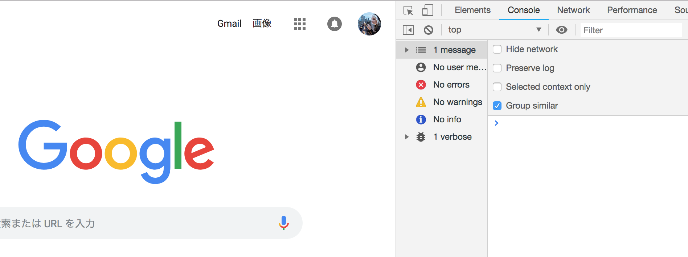

### #01. JSの特徴

<a href="../">戻る</a>

---

#### 目次

<ul>
  <li>特徴1: 動的型付け言語
    <ul>
      <li>動的型付け言語と静的型付け言語の比較</li>
      <li>TypeScriptの話 </li>
    </ul>
  </li>
  <li>特徴2: プロトタイプベース</li>
  <li>特徴3: 関数型、オブジェクト指向風に書くことが可能</li>
  <li>特徴4: バージョン(ES5, ES201X)</li>
  <li>特徴5: ブラウザでも確認できる</li>
  <li>まとめ</li>
</ul>

---

#### 特徴1: JSは動的型付け言語

JavaScriptはPHPと同様に<b class="-u">動的に型を付けるプログラミング言語</b>です。  
動的型付け言語には、<b class="-u">実行前に型をチェックせず、実行中に型を評価する</b>という特徴があります。  
静的型付け言語はその逆で、念のためまとめますと次のようになります。

--

#### 動的型付け言語と静的型付け言語の比較
<h5 class="-mt24">動的型付け言語</h5>
- 実行前に型をチェックせず、実行中に型を評価する
- 実行したときにはじめて型が判明する

<p class="-mt24 -mb24">言語：PHP, JavaScript, Ruby</p>

<h5 class="-mt24">静的型付け言語</h5>
- 実行前に型を評価する
- 静的解析によってコンパイル・実行前にバグを発見できる

<p class="-mt24">言語：C, C++, C#, Swift, Java, Go</p>

--

<h5 class="-mt24">動的型付け言語</h5>

javascriptは、動的型づけ言語のため、意図しない動作でも問題なく実行してしまうことがあります。  
例えば、本来は数字 + 数字を行う想定の関数にも関わらず、文字列の結合を行なってしまうなどです。
```javascript
// 本来は数字 + 数字を行う想定の関数
function add(a, b) {
  //a, bが、文字列なのか数字なのかに関わらず足す。
  var result = a + b;
  console.log(result)
}

add(1, 3); //4
add(1, '3'); //'13'
add('1', '3');  //'13'
add('hoge', 'hoge'); //hogehoge
// ※問題なく処理され、エラー表示されない
```
ちなみに、実行して出力してみないと確認が難しいので、これを避けるためにTypeScriptというものが最近、流行っています。

--

#### TypeScript(少し脱線)

JSの拡張言語の1つに、<b class="-u">TypeScript</b>という言語があります。  
<b class="-u">Microsoftが開発</b>したこの言語は、動的型付け言語であるJSに<b class="-u">静的型付け機能を持たせた言語</b>となっています。  
JSによるアプリケーションの開発規模が拡大し、静的解析の需要が高まった故に、現在盛んに開発されている言語です。
<br><br>
しばらくは触れることはないかもしれませんが、近年かなり流行しているため、名前と概要だけは覚えておきましょう◎

---

#### 特徴2: JSはプロトタイプベース

<p class="-small">とりあえず今は<b class="-u">「JSはクラスベースではなく、プロトタイプベースである」</b>ということだけ把握しておけば大丈夫です。初学者のうちはこれを理解していなくても、業務に支障は出ません。<br>ややこしいので、もっと勉強したくなったときに、以下のURLを見て勉強してみてください。</p>

<p class="-ex-small -mt24"><a href="https://developer.mozilla.org/ja/docs/Web/JavaScript/Guide/Class-Based_vs._Prototype-Based_Languages">Class-Based vs. Prototype-Based Languages - JavaScript | MDN</a></p>

---

#### 特徴3: JSは関数型の側面を持ち、オブジェクト指向風に書くことも可能

<p class="-mb24 -small">要するにJSは様々な書き方ができる柔軟な言語という話です。</p>

<ul class="-mt24">
  <li>関数型：副作用を排除して、単純な関数を組み合わせていくことで、必要な結果を導くプログラミング手法</li>
  <li>オブジェクト指向：オブジェクト同士のやりとりで必要な結果を導くプログラミング手法</li>
</ul>

<p class="-mt24 -small">これらのプログラミング手法をJSはすべて実現できます。これはJSの特徴の1つです。</p>

-- 

#### 特徴3: JSは関数型の側面を持ち、オブジェクト指向風に書くことが可能

<ul class="-mt24">
  <li>関数型：副作用を排除して、単純な関数を組み合わせていくことで、必要な結果を導くプログラミング手法</li>
</ul>
<br>
<p>副作用がない</p>
<ul>
  <li>関数は外側の変数を変更しない</li>
  <li>参照渡しの引数の値を変更しない</li>
</ul>

```javascript
var z = 2;
function add(x, y) {
  return x + y;
}
console.log(add(z, 3)); // 5
console.log(add(z, 3)); // 5
```

-- 

#### 特徴3: JSは関数型の側面を持ち、オブジェクト指向風に書くことも可能

一見、クラスをインスタンス化(new)してプロパティを実行していくオブジェクト指向に見えます。
```javascript
// Personクラス
var Person = function(name) {
  this.name = name;
}
//PersonクラスのgetNameメソッド
Person.prototype.getName = function() {
    return this.name;
}

// Personインスタンスを生成
var taro = new Person('太郎');
console.log(taro.getName()); // '太郎'

taro.getName = function() {
  return 'kudo'
}
console.log(taro.getName()); // 'kudo'
```
しかし、このように、生成したインスタンスの挙動を後から差し替えることができてしまうので、あくまでオブジェクト指向<span class="-b">風</span>としています。<br>
https://qiita.com/uhyo/items/ab8e273e1eb71d02e29a

---

#### 特徴4: バージョン(ES5, ES201X)

<p>実はJavaScriptにはECMAScript（エクマスクリプト）という仕様があり、<br>その仕様に基づき各ブラウザエンジンに実装されたものが、Javasciptになります。</p>
<br>
<p>ECMAScriptのバージョンをES◯, ES201Xと表現しています。<br>ES6はES2015とも呼ばれ、ここではES6以降のことを総称して、ES201Xと表現していきます。</p>

-- 

#### 特徴4: バージョン(ES5, ES201X)

<p class="-mb24 -small">ES5とES201Xの違い</p>

・ES5<br>
現状、弊社の対象ブラウザ全てで動作します。

```javascript
var hoge = 'hoge'
```

・ES201X<br>
一部のブラウザで動作しなかったり、全く同じ動作を担保してくれないことがあります。
```javascript
const hoge = 'hoge'
```
各ブラウザにおける対応状況が重要になってきますので、確認しやすいサイトをご紹介します。

-- 

#### 特徴4: バージョン(ES5, ES201X)

<p class="-mb24 -small">ブラウザ対応状況確認</p>

https://caniuse.com/

<p class="fragment">実際に const で検索してみてください。</p>
<p>IE6〜10はNot supportedで対応外、IE11は使用できることがご確認できるかと思います。<br>また、AndroidBrowserの3〜4.4.4は、条件付きの対応です。</p>

-- 

#### 特徴4: バージョン(ES5, ES201X)

<p class="-mb24 -small">ちなみに...弊社のサポートブラウザ</p>

https://www.gnavi.co.jp/  
ぐるなびTOPの最下部にある 利用条件 リンクをクリックして遷移してみてください。

--- 

#### 特徴5: 開発者モードでも確認できる

<p class="-mb24 -small">console.log()メソッドを利用することによって、開発者モードの<span class="-b">console</span>欄にて、出力が可能です。<br>また、実行時のエラーもこのconsoleに出力されます。</p>

```javascript
console.log('a')
```
<br>
ブラウザを開き、「option」・「command」・「i」を同時に押すと開きます。  
devtoolsのConsole  


--

###### ですが、しばらくは、オンラインエディタのjsbinというサイトを使用していきます。  
https://jsbin.com/?js,console  

<ul>
  <li>javascriptのみの動作確認ができる。</li>
  <li>jQueryで記述できる（設定必要）</li>
  <li>ES201Xで記述できる（設定必要）</li>
</ul>
<br>
<p class="-small">このあとの講義に関しては、構文等のご説明とともにスライドにソースコードを書いてありますので、jsbinに移し、動作確認しながらお聞きいただきたいです。<br>
期待の動作がしない、エラーが出ている場合などは遠慮なくお声がけください。</p>

---

#### JSの特徴まとめ

- 動的型付け言語
- プロトタイプベース
- 関数型、オブジェクト指向風に書くことが可能
- バージョン(ES5, ES201X)
- ブラウザでも確認ができる

<p class="-mt24">これらの特徴は覚えておくと、後々のお話の理解度を底上げするのに役立ちます👍<br></p>
