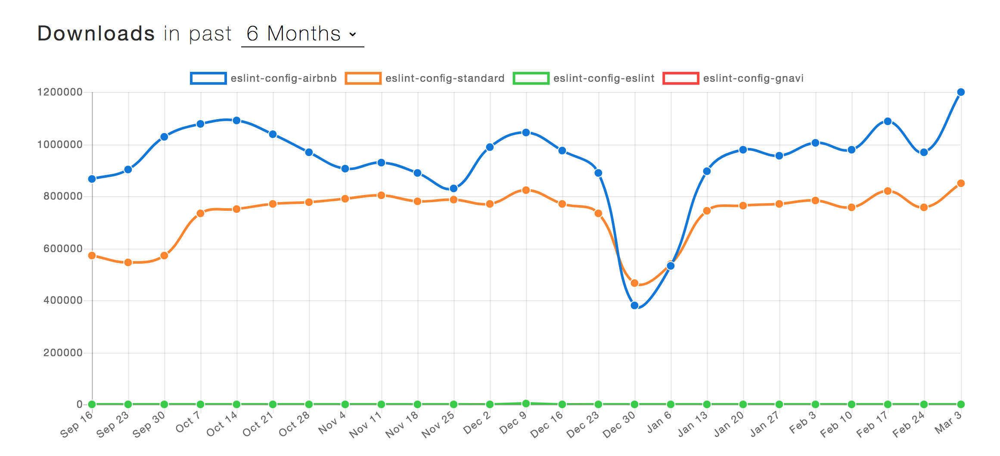

### #07. JavaScript の書き方の話

<a href="../">戻る</a>

---

#### 目次

- 今更、書き方？
- eslint
- prettier

---

<h2 class="-center">今更、書き方？</h2>

--

<h3 class="-center">JSは人によって、<br>書き方が微妙に異なります。</h3>

--

- 演算子の両隣には空白スペースを一つ入れる派、気にしない派
```js
const sum = (x, y) => x + y
const sum =(x,y)=> x+y
```
- オブジェクトの最後のkeyのvalueの後ろにはカンマを付ける派、付けない派
```js
const obj = {
  key: 'val',
  key2: 'val2',
}
const obj = {
  key: 'val',
  key2: 'val2'
}
```
- クォートはシングルを使う派、ダブルを使う派
```
const sushi = "maguro"
const sushi = 'ikura'
```

--

<h3 class="-center">そこで登場したのが、<br> `ESlint` や `prettier` です。</h3>

---


<h2 class="-center">ESlint</h2>


--

#### ESlint とは？

<blockquote class="-small -mb24">ESLint は JavaScript のための静的検証ツールです。コードを実行する前に明らかなバグを見つけたり、括弧やスペースの使い方などのスタイルを統一したりするのに役立ちます。同様のツールとしては JSLint, JSHint 等があります。</blockquote>

<p class="-mt24">引用: <a href="https://qiita.com/mysticatea/items/f523dab04a25f617c87d">ESLint 最初の一歩</a></p>

--

#### ESLintはどんなチェックをしてくれるの？

次のページで解説します。

--

##### スタイルに関する警告
```js
// (このルール上では)セミコロンを付けてはいけません。
const aiu = 'あいう';

// (このルール上では)オブジェクトの最後のカンマは必須です
const obj = {
  key1: 'val',
  key2: 'val2',
  key3: 'val3'
}

```
動作に影響することがほぼほぼないが、統一したいものです。


--


##### バグを作らないための警告

```js
// 厳密等価演算子(等値演算子)を使わないと怒られる
console.log('hoge' == 'fuga')

// else句いらなくない？って指摘してくれる
const func = (x) => {
  if(x === 'hoge') {
    return 99
  } else {
    return 88
  }
}

```

--

#### eslintの挙動確認

skilltrans-fe_201902_testリポジトリのmasterブランチにて、
```shell
git pull
npm i
npm run dev
```
src/js/test_transfer.jsに下記を入力後、保存してみてください。  
```javascript
var hoge = 'hoge';
```
ターミナルのログにerror  Unexpected var, use let or const instead と出力されてますね。  
(現在は、errorになっても続行するようにしていますが、必ず処理を止めている場合もあります)

---

#### ESLintのメリット

--

#### ESLintのメリット

<ul>
  <li>メリット1:<span class="fragment">ビルド環境に組み込めば、バグが混入する可能性をかなり下げてくれます。</span></li>
  <li>メリット2:<span class="fragment">レビューの手間が省け、作業効率が上がります。</span></li>
  <li>メリット3:<span class="fragment">JSにおけるベストプラクティスを教えてくれるので、コードを書く力が知らず知らずのうちについていきます。(ただし、ルールを理解していれば)</span></li>
</ul>

--

#### ただ、<span class="fragment">項目が多く、すべて話し合うのは難しいかもしれません。</span>

https://eslint.org/docs/rules/

<p class="-mb24 fragment">eslintは自分でルールを取捨選択できる他、<b class="-u">他人のルールを継承する</b>ことも出来ます。</p>

--

#### ルールの例

<ul class="-mt24">
  <li class="-mt24">eslint-config-airbnb<br>民泊のairbnbの中の人が作ったルールです。reactのルールも入ってて、人気があります。</li>
  <li class="-mt24">eslint-config-standard<br>有名な団体の標準とかではありませんが、セミコロン無し派のルールとして人気があります。</li>
  <li class="-mt24">eslint-config-eslint<br>ESLintチームが使っているルールです。公式感あって一番人気かと思いきや、あんまり人気はありません。</li>
  <li class="-mt24">eslint-config-gnavi<br>弊社で設けているconfigになります。</li>
</ul>

--

#### eslint-configのトレンド

<p>どれが絶対的に良いみたいなものはないので、参考までにトレンドをご紹介します。</p>

https://www.npmtrends.com/eslint-config-airbnb-vs-eslint-config-standard-vs-eslint-config-eslint-vs-eslint-config-gnavi
<br>
<p>eslint-config-airbnbが無難かもしれません。</p>

--

#### .eslintrc.js の書き方

```js
module.exports = {
  // ルールの継承をするところ.
  extends: ['airbnb', 'prettier'],

  // プラグインの指定.reactなどの特殊なjsを検証するときに使います
  plugins: ['react', 'prettier'],

  // 構文解析するツールの宣言。宣言しないとデフォルトになる。
  parser: 'babel-eslint',

  // 環境の設定。ここでチェックするJSはブラウザで使うことを前提とするよ、という宣言。
  env: {
    browser: true,
  },

  // ルールを書くところ。もしくは、extendsしたけど、無効にしたいルールを調整するところ
  rules: {
    // ここにルールを書く
  },
}

```

<p class="-mt24">環境構築の際に避けて通れないので、「検索したら書ける」ぐらいの記憶はしておきましょう。</p>

--


#### あとはnpm scriptを書いて実行するだけ！

```
"scripts" {
  "lint": "eslint './src/js/**/*.js'"
},
(後略)
```

`実行`

```
npm run lint
```

--

#### ESlint おわりに

複雑化してきたJSを書く上で、ESlintは必須ツールとなってきています。  
勉強のためにも、eslintを使用する環境を整えて学習していきましょう！

---

<h2 class="-center">prettier</h2>

--

#### prettier とは？

prettierとはコードのスタイルを矯正することに特化したツールです。  
eslintと違って、バグを防止するような警告は発しません。  
また、<b class="-u">eslintによる整形よりも綺麗な整形をしてくれます。</b>(主観も少しある)

<br>
before
```javascript
  var foo = {
    bar: 'bar string',
    baz: 11
  }
```
<br>
after
```javascript
  var foo = {
    bar: "bar string",
    baz: 11
  };
```

-- 


#### eslintと役割が重複してしまう問題

eslintとprettierは役割が重複している部分があります。  
でも、バグの混入を防ぐルールも欲しいですし、prettierによる綺麗な整形も欲しいですよね？  
そんな欲張りに応えるため、prettierは <span class="-b">eslint-config-prettier</span> というルールを提供して、重複してしまうようなルールをすべてoffにするconfigを配布しています。

--

#### 導入までの手順

<ul>
  <li class="fragment">手順1. npm install prettier chokidar</li>
  <li class="fragment">手順2. .prettierrc を書く(書かないと標準設定になる)</li>
  <li class="fragment">手順3. npm scriptsを書く</li>
  <li class="fragment">手順4. 実行する</li>
</ul>

--

#### .prettierrc の書き方とルール紹介

<p class="-mb24">設定を列挙していくだけです。</p>

```
// １行あたりの文字制限
printWidth: 80

// インデントの深さの指定
tabWidth: 2

// 文字列を囲ったりするクォートはシングルクォートを優先させる指定
singleQuote: true

// 末尾のカンマは常につける指定
trailingComma: all

// セミコロンはつけない指定
semi: false

// ブロック{}の前後はスペースを設ける指定
bracketSpacing: true
```

<p class="-mt24">上記以外の設定項目は<a href="https://prettier.io/docs/en/options.html">公式</a>を参考にしましょう✨</p>

--

あとはnpm scriptを書いて実行するだけ！

```json
"scripts" {
  "prettier-fmt": "prettier --write './src/js/**/*.js'",
  "prettier-watch": "chokidar './src/js/**/*.js' -c 'npm run prettier-fmt'"
},
(後略)
```

`実行`

```
npm run prettier-watch
```
---

### まとめ

- 書き方のゆらぎを矯正するために、eslintやprettierは必須ツール！
- eslint はスタイルもベストプラクティスも教えてくれる
- prettier はスタイル矯正に特化したツール！
