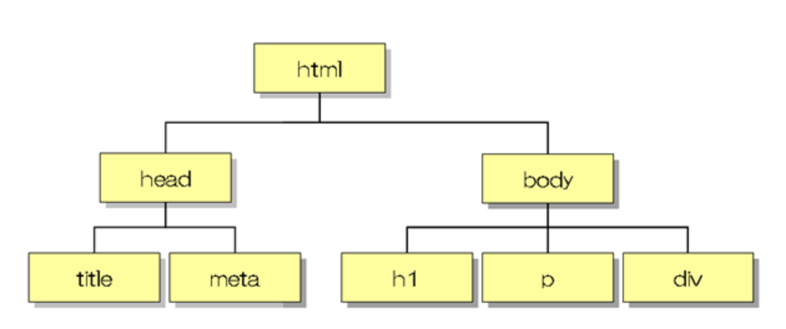

### #08. DOM操作

<a href="../">戻る</a>

---

#### 目次

<ul>
  <li>DOMとは</li>
  <li>DOM取得でよく使うメソッドを紹介
    <ul>
      <li>document.getElementById()</li>
      <li>document.getElementsByClassName()</li>
      <li>document.getElementsByTagName()</li>
      <li>document.querySelector()</li>
      <li>document.querySelectorAll()</li>
      <li>$(element) <span class="-n">(jQuery)</span></li>
    </ul>
  </li>
  <li>配列っぽい操作</li>
  <li>イベントリスナーとイベント</li>
</ul>
<br>

---

#### DOMとは

<blockquote class="-small">Document Object Model（DOM）はウェブページとスクリプトやプログラミング言語を接続するものです。</blockquote>

<p><b class="-u">HTMLをJavaScriptから操作するための仕組み</b>、ぐらいの解釈で大丈夫です。</p>  

<div class="-mt48"></div>
##### DOMツリーとは
<p>HTMLの階層をツリー構造で表現したもので、一般的に「DOM」と呼ばれるもの</p>


---

### DOMの取得でよく使うメソッドを紹介
<ul>
    <li>①document.getElementById()</li>
    <li>②document.getElementsByClassName()</li>
    <li>③document.getElementsByTagName()</li>
    <li>④document.querySelector()</li>
    <li>⑤document.querySelectorAll()</li>
    <li>⑥$(element) <span class="-n">(jQuery)</span></li>
  </ul>

--

#### ①document.getElementById()

--

#### ①document.getElementById()

<span class="-small">HTML<span>
```html
<%# タイトル -%>
<!-- title -->
<h1 class="title" id="js-id-test">
  <span class="title__main"><%= data.genre.title.main %></span>
  <span class="title__sub"><%= data.genre.title.sub %></span>
</h1>
<!-- /title -->
```
<span class="-small">JS<span>
```
const dom = document.getElementById('js-id-test')
console.log(dom) // 一つのElement オブジェクトが格納されている
```

document.getElementById()は、引数に文字列でidを指定して使用します。指定したidがドキュメント上に存在すれば、そのElementを返却します。<br>
もし、<b class="-u">指定したidがHTML上に存在しなければ、nullを返します。</b>

--

#### プロジェクトでDOMを扱うときはこんな具合に。

<span class="-small">HTML<span>
```html
<%# タイトル -%>
<!-- title -->
<h1 class="title" id="js-id-test">
  <span class="title__main"><%= data.genre.title.main %></span>
  <span class="title__sub"><%= data.genre.title.sub %></span>
</h1>
<!-- /title -->
```

<span class="-small">JS<span>
```js
const dom = document.getElementById('js-id-test')

if (dom !== null) {
  console.log('DOMがあるから関数を実行')
}
// 意図したdomがなければ処理を実行しない

```
これは、意図しないときに関数が発火してエラーを吐いてしまうことを防ぐための処理です。  
DOMを扱うときは影響範囲の可能性を意識して、意図したページ以外で動作しないように記述をしましょう。

--

#### ②document.getElementsByClassName()

--

#### ②document.getElementsByClassName()

getElementsByClassName()は引数に文字列でクラス名を指定して使用します。  
引数に指定したクラス名がドキュメント内に存在するか否かに関わらず、常にHTMLCollectionという<span class="-b">"配列っぽいオブジェクト"</span>を返り値とします。
ドキュメント内に存在しなかった場合は空のHTMLCollectionが返り値となります。(※nullではありません)

<span class="-small">HTML<span>
```html
<ul class="js-list">
  <li class="js-list-item">要素1</li>
  <li class="js-list-item">要素2</li>
  <li class="js-list-item">要素3</li>
</ul>  
```
<span class="-small">JS<span>
```
const listItem = document.getElementsByClassName('js-list-item')
console.log(listItem) // HTMLCollectionという"配列っぽいオブジェクト"が格納されている
```
--

#### getElementsByClassName()とforEach()

getElementsByClassName()で返却される値は「配列」ではなく、<b class="-u">「配列っぽいオブジェクト」</b>です。  
つまり、<b class="-u">配列の章で学んだArray.prototype.forEach()を使って処理をすることはできません。</b>


<span class="-small">HTML<span>
```html
<ul class="js-list">
  <li class="js-list-item">要素1</li>
  <li class="js-list-item">要素2</li>
  <li class="js-list-item">要素3</li>
</ul>  
```
<span class="-small">JS<span>
```js
const listItem = document.getElementsByClassName('js-list-item')
listItem.forEach((item) => {
  console.log(item.innerHTML) //forEach is not a function
})
```
--

#### ③document.getElementsByTagName()

--

#### ③document.getElementsByTagName()

getElementsByClassName()とほとんど同じです。  
引数に指定したタグ名があれば、HTMLCollectionという<span class="-b">"配列っぽいオブジェクト"</span>を返り値とします。  
getElementsByClassName()と同じように、ドキュメント内に存在しなかった場合は空のHTMLCollectionが返り値となります。(※nullではありません)

<span class="-small">HTML<span>
```html
<ul>
  <li>要素1</li>
  <li>要素2</li>
  <li>要素3</li>
</ul>  
```
<span class="-small">JS<span>
```js
const liTags = document.getElementsByTagName('li')
console.log(liTags) // HTMLCollectionという"配列っぽいオブジェクト"が格納されている
```
--

#### ④document.querySelector()

--

#### ④document.querySelector()

document.querySelector()は<b class="-u">引数にセレクタを指定して、その対象の要素があればそのElementを返却し、なければnullを返却します。</b><b class="-u">もし、対象の要素が複数ある場合は最初に見つかったElementを一つ返却します。</b>  
引数内には、cssセレクタの要領でidやclass, 要素セレクタを指定できます。

```js
document.querySelector('#foo') // idのfooを探す
document.querySelector('.foo') // 最初に見つかったclassのfooを一つ返す
const liTag = document.querySelector('li') // 最初に見つかったliタグを一つ返す
console.log(liTag)

document.querySelector(".foo input[name='hoge']")
// 最初に見つかったclassのfooの中の、inputタグのname属性がhogeのElementを返す
```

最後の例から分かるように、<b class="-u">document.querySelector()は複雑なセレクタを指定するときに、真価を発揮します。</b>

--

#### ⑤document.querySelectorAll()

--
#### ⑤document.querySelectorAll()

document.querySelectorAll()は<b class="-u">引数に指定したセレクタ</b>にマッチする、文書中の要素のリストを示す静的な（生きていない）<b class="-u">NodeList</b>を返します。  
もし、指定したセレクタが何もマッチしなくても、空のNodeListを返します。(※nullではありません)


<span class="-small">HTML<span>
```html
<ul class="js-list">
  <li class="js-list-item">要素1</li>
  <li class="js-list-item">要素2</li>
  <li class="js-list-item">要素3</li>
</ul>
```

<span class="-small">JS<span>
```js
const hoges = document.querySelectorAll('.js-list-item')
console.log(hoges)// NodeListという"配列っぽいオブジェクト"が格納されている
```

-- 

#### ②document.getElementsByClassName() vs ⑤document.querySelectorAll()

今までの内容をまとめると下記になります。
<table>
<tr><th></th><th>返却値</th><th>静的・動的</th></tr>
<tr><td>getElementsByClassName</td><td>HTMLCollection</td><td>動的</td></tr>
<tr><td>querySelectorAll</td><td>NodeList</td><td>静的</td></tr>
</table>
<p class="-mt24">静的・動的という表現がありますが、詳細は次のスライドで説明します。</p>

-- 

##### HTMLCollection(動的)の場合

HTML
```html
<ul id="js-dom" class="js-dom">
  <li class="js-dom-item">要素1dom</li>
  <li class="js-dom-item">要素2dom</li>
  <li class="js-dom-item">要素3dom</li>
</ul>
```
HTMLCollectionの場合
```javascript
//①要素取得
const firstHtmlCollection = document.getElementsByClassName('js-dom-item');
console.log(firstHtmlCollection.length); // 3

//②作成した要素を追加
const elNewList = document.createElement('li');
elNewList.classList.add('js-dom-item');
document.getElementById('js-dom').appendChild(elNewList);

//③最初に取得した変数を出力
console.log(firstHtmlCollection.length); // 4
```
①で取得したfirstHtmlCollectionは何もしていないが、②で追加した要素が反映されており、firstHtmlCollectionの要素数が3から4に増えています。  

--

##### NodeList(静的)の場合

HTML
```html
<ul id="js-dom" class="js-dom">
  <li class="js-dom-item">要素1dom</li>
  <li class="js-dom-item">要素2dom</li>
  <li class="js-dom-item">要素3dom</li>
</ul>
```
NodeListの場合
```javascript
//①要素取得
const firstNodeList = document.querySelectorAll('.js-dom-item');
console.log(firstNodeList.length); //3

//②作成した要素を追加
const elNewList = document.createElement('li');
elNewList.classList.add('js-dom-item');
document.getElementById('js-dom').appendChild(elNewList);

//③最初に取得した変数を出力
console.log(firstNodeList.length); // 3
```
②で追加した要素が反映されておらず、firstNodeListの要素数は3のままです。  
静的である方が扱いやすいので、<span class="-u">querySelectorAllを選択することが多いです。</span>
--

#### ⑥$() <span class="-n">(jQuery)</span>

jQueryの要素の取得は、$(selectorName)だけで、jQueryオブジェクトを返却します  
ドキュメント内に存在しなかった場合は空のjQueryオブジェクトが返り値となります。(※nullではありません)

```javascript
$('#hoge')
$('.hoge')
$('div')

$('.js-dom-item').each(function (index, value) {
  console.log(index, value)
})
```

---

#### 配列っぽい操作
<ul>
    <li>◯番目の要素</li>
    <li>Array.prototype.forEach()</li>
</ul>

-- 

##### 配列っぽい操作
・◯番目の要素
<br>
<span class="-b">配列っぽい</span>NodeListという説明をしてきましたが、その意味としては、取得した要素の中で、◯番目と指定したいときに配列のようにアクセスできることを指します。
HTML
```html
<ul class="js-list">
  <li class="js-dom-item">要素1</li>
  <li class="js-dom-item">要素2</li>
  <li class="js-dom-item">要素3</li>
  <!-- ②<li class="js-dom-item"></li> -->
</ul>
```
<br>
```javascript
//①要素の取得
const firstNodeList = document.querySelectorAll('.js-dom-item');

//②追加したい要素を作成
const newElm = document.createElement('span');
newElm.innerText = '番目';

//③２つ目の<li class="sample_li">内にnewElm追加
firstNodeList[1].appendChild(newElm);
```

--

##### 配列っぽい操作
・◯番目の要素
<br>
開発者モードのElements欄で確認すると、2番目の要素のみ、span要素が挿入されています。
```html
<ul id="js-dom" class="js-dom">
  <li class="js-dom-item">要素1dom</li>
  <li class="js-dom-item">要素2dom<span>番目</span></li>
  <li class="js-dom-item">要素3dom</li>
</ul>
```

--
##### 配列っぽい操作
・Array.prototype.forEach()

NodeListは<span class="-b">配列っぽい</span>のですが、Array.prototype.forEach()は実行することができません。(※実行できないのはIE11, Android4.4で、Chromeであれば問題なく実行できます。)<br>そこで一度、<span class="-b">配列に変換</span>してからforEachメソッドを実行します。
<br>
HTML
```html
<ul class="js-list">
  <li class="js-dom-item">要素1</li>
  <li class="js-dom-item">要素2</li>
  <li class="js-dom-item">要素3</li>
<ul>
```
<br>
```javascript
const sampleLi = Array.prototype.slice.call(document.querySelectorAll(".js-dom-item"))
console.log(sampleLi)
sampleLi.forEach((value, index) => {
  console.log(value)
  console.log(index)
})
```

--- 

#### イベントリスナーとイベント

-- 

#### イベントリスナーとは

①どの要素に、②どういうイベントが発火するたびに、③どういう処理を行うか設定できるものになります。  
例)  
①ボタンを②ユーザーがクリックしたら、③consoleにclickされました!と出力する  
<span class="-b">addEventListenerメソッド</span>を使用して<br><span class="-b">要素.addEventListener('イベント名',処理)</span>と記述します。

<span class="-small">HTML<span>
```
<div id="trigger">button</div>
```

<span class="-small">JS<span>
```js
const trigger = document.querySelector('.js-trigger')

trigger.addEventListener('click', function() {
  // クリックされた後に処理を実行させる
  console.log('buttonがclickされました!')
})
```

-- 

#### イベントリスナーとは

幾度も発火される可能性があるイベントのイベントリスナー内での<br>イベントリスナーの付与は<span class="-b">NG</span>です。  
例えば、クリックイベントで他の要素にクリックイベントを付与すると...  
badケース
```js
const trigger = document.querySelector('.js-trigger')
const trigger2 = document.querySelector('.js-trigger2')

trigger2.addEventListener('click', function() {
  // クリックされた後に処理を実行させる
  console.log('button2がclickされました!')
  trigger.addEventListener('click', function() {
    // クリックされた後に処理を実行させる
    console.log('buttonがclickされました!')
  })
})
```
button2を二度クリックした後、buttonをクリックすると、<span class="-b">②buttonがclickされました!</span>と出力され、二度実行されていることがわかると思います。

-- 

#### イベントリスナー

jQueryの場合、<span class="-b">on()メソッド</span>を使用します。<br>
<span class="-small">HTML<span>
```
<div id="trigger">button</div>
```

<span class="-small">JS<span>
```javascript
$('#trigger').on('click', function(){
  console.log('clickされました!')
})
```

-- 

#### イベント

代表的なclickイベントの他にもイベントは存在します  
例えば...
<ul>
  <li>focus<br>要素がフォーカスされたとき。</li>
  <li>submit<br>フォームがsubmitされたとき。</li>
  <li>change<br>フォームの値の変更が確定されたとき。</li>
  <li>load<br>画像などのすべてのリソースが読まれたとき。</li>
</ul>

<p class="-align-right"><a href="https://listener.noplan.cc/">イベントを確認できるサイト</a>がわかりやすいので、少し紹介します</p>

-- 

#### イベント制御

htmlが下記の状態の時に、二重にclickイベントを付与してclickしてみると...
```html
<div class="outer">
  <div class="inner"></div>
</div>
```
<br>
```javascript
document.querySelector('.outer').addEventListener('click', function() {
  console.log('outer!!')
})

document.querySelector('.inner').addEventListener('click', function() {
  console.log('inner!!')
})
```
inner要素をクリックした時に①inner!!,②outer!!の順にconsoleに出力され、内側から外側へイベントが連続して発火しています。。  
innerだけ発生させる方法もありますので、次のスライドで説明します。

-- 

#### イベント制御

innerをクリックしたときは、inner!!のみ発火させたいときは、event.stopPropagation();を使用します。
```html
<div class="outer">
  <div class="inner"></div>
</div>
```
<br>
```javascript
document.querySelector('.outer').addEventListener('click', function() {
  console.log('outer!!')
})

document.querySelector('.inner').addEventListener('click', function(event) {
  event.stopPropagation();
  console.log('inner!!')
})
```
event.stopPropagation()メソッドは、その要素のイベント発火後に、親要素のイベント発火させない効果があります。

-- 

#### イベント制御

他にもevent.preventDefault()というイベントに関するメソッドも紹介します。  
このメソッドは、その要素のイベントをキャンセルさせることができます。

```html
<a href="https://www.google.co.jp/" class="link">google</a>
```
<br>
```javascript
document.querySelector('.link').addEventListener('click', function(event) {
  event.preventDefault();
  // googleのトップページではなく、「イベント伝播」の検索結果に飛ばす
  const href = document.querySelector('.link').href
  location.href = href + '/search?q=イベント伝播'
})
```
clickイベントの制御は、行うことが多いですので、stopPropagation, preventDefaultは使いこなせるようにしておく必要があります。

---

#### まとめ
- DOMはHTMLをJavaScriptから操作するための仕組み。
- HTMLCollection, NodeListなどの返却値の型を把握し、空のときの挙動も覚えましょう。
- プロジェクトでDOM操作を行うときは、操作対象がなかったときにエラーを出さないような工夫をしましょう。
- 各種イベントの発火タイミングを知り、イベントリスナーの登録、イベント制御の方法も覚えましょう。

-- 

##### 余裕があれば課題


- 課題1  
button,button2というボタンが用意されていますが、<br>「button」をクリックしたら、「button2」が「ボタン」に変更されるようにしてください。<br>要素のテキストは 要素.innerText で取得できます。

- 課題2  
panelクラスのある要素がaタグになっています。<br>このaタグのページ遷移イベントを止めて、googleのホームに遷移させてください。
