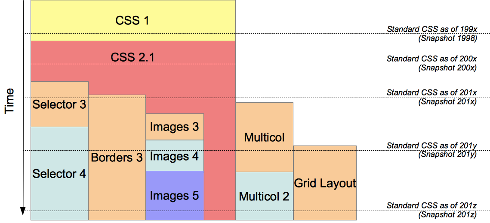
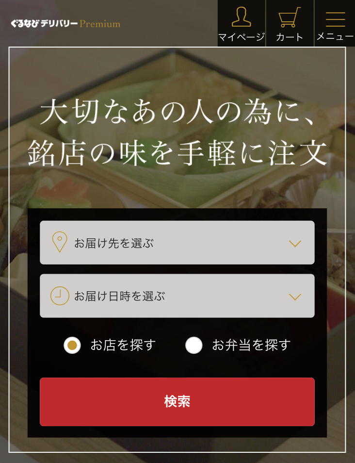
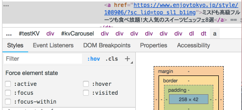
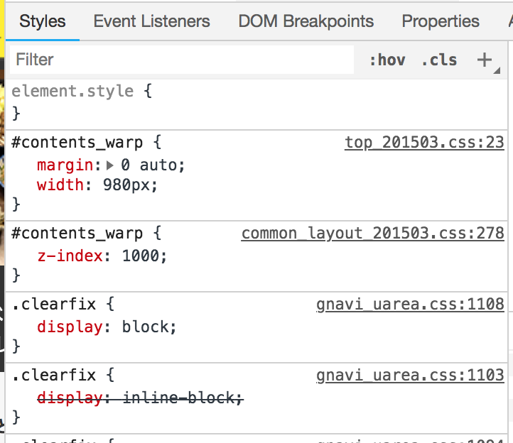
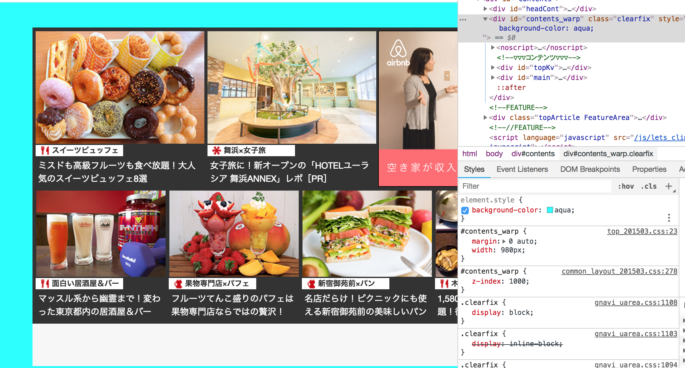

#### #03-1. CSS概要

レガシーな状態からのリファクタリングのお話がありましたが、 この講義後もフロントエンドがサポートする予定ですので、その中でサポートさせてください。

<a href="../">戻る</a>

---

#### もくじ 📝

* CSSとは
* CSSのバージョン
* CSSの表現（ピックアップ）
* ブラウザにおけるCSSの見方

---

#### CSS とは

--

#### CSS とは

CSSはCascading Style Sheets （カスケーディング・スタイル・シート)の略です。

<blockquote class="-small">Cascading とは、「階段状の滝のような」「連鎖的に伝わる」という意味ですが、 様々なレベルで定義されたスタイルは、上流で定義されたものが下流へ引き継がれて文書に適用されます。 このようにスタイル指定が段階的に引き継がれて文書に適用されるのが CSS の大きな特徴です。</blockquote>

引用：http://www.htmq.com/csskihon/006.shtml

 
CSS は、web ページの見た目（スタイル）を調整する宣言的な言語

「上流から下流に引き継がれて適用される」というイメージをお持ちいただければ問題ありません。

--

#### CSSは、CSSファイルに

HTML5 以前は font タグや,marquee タグがなどが存在し、見た目も HTML で宣言することができました。

<pre><code>懐かしのフォントタグ
<marquee>デフォルト</marquee>
</code></pre>

しかし、見た目の宣言を HTML を実施してしまうと<b class="-u">文章構造が複雑</b>になってしまい、サイトにどのような情報があるのか分かりにくくなってしまいます。 その他にも、HTMLタグでの装飾はデザインの変更が実施し難くなるなどのデメリットがあります。
 

これらの背景から、<b class="-u">文章構造</b>と<b class="-u">表現の分離</b>のために CSS は誕生しました。

---

#### CSS のバージョン

--

#### CSS のバージョン

javascript にバージョンがあるように、 CSS も少しずつバージョンアップをして今日に至ります。

出典：<a href="https://developer.mozilla.org/ja/docs/Web/CSS/CSS3">CSS3 | MDN</a>

・大事なのは日々バージョンアップしているので、弊社の対象ブラウザすべてで、 全てのCSSが適用できるわけではないということです。

・余談ですが、実は、CSS3という表現は正しくありません。CSS2以降は、モジュールごとに仕様が策定されています。

---

#### ちなみに、CSS だけでこんなことができます
- ①簡単なアイコン
- ②状態変化時の表現
- ③動的な表現も少し

紹介していきますが、こんな表現もできるのかくらいの認識で問題ありません。

-- 

##### ①簡単なアイコン

ここら辺はCSSでいけそうだなあと感じます。

<a href="https://cssicon.space/#/" class="-mt36">CSSによるiconについてまとめているサイト</a>が便利です  
・アイコンをクリックすると横にcssの記述例がでてきます。  
・hoverすると該当箇所に色がつきます。

-- 

##### ②状態変化時の表現

まずは、「スイーツビュッフェ」下のテキストをマウスホバーしてみてください。

<a href="https://www.enjoytokyo.jp/" class="-small">Let's ENJOY TOKYO</a>

このようにその要素の状態に応じて、スタイルを表現できます。
  

- visited擬似クラス: 訪問済のリンクにスタイルを適用する
- hover擬似クラス: カーソルが乗っている要素にスタイルを適用する
- focus擬似クラス: フォーカスされた要素にスタイルを適用する <a href="http://www.htmq.com/selector/link.shtml">など</a>

ちなみに、開発者モードのelements欄で#contents aを選択状態にして、Stylesの:hovをクリックすると状態を変更できます。

-- 

##### ③動的な表現も少し

Apple WWDC2015 のロゴ(のアーカイブ)
https://cssanimation.rocks/demo/wwdc15/

CSSプロパティとしては下記を使用しています。
- animation
- keyframes

---

#### ブラウザにおけるCSSのデバッグ
- 特定の要素に適用されているCSSプロパティの見方
- ブラウザ上でのデバッグ

--

#### ブラウザにおけるCSSのデバッグ
- 特定の要素に適用されているCSSプロパティの見方

https://www.enjoytokyo.jp/
開発者モードのelements欄にて、要素を選択してください。(id="contents_wrap" class="clearfix")  

Styles欄を見ていただくと、CSSプロパティがいくつかに区切られて出てきます。  
上にあるほど優先され、上で上書きされているものは取り消し線がついています。  

--

#### ブラウザにおけるCSSのデバッグ
- ブラウザ上でのデバッグ

element.style欄は空ですが、ここをクリックして、CSSプロパティを入力すると、ブラウザ上でデバッグできます。  あくまでブラウザ上なので、リロードすると消えます。

---

### まとめ

* CSS は見た目を表現する言語
* CSSはCSSファイルに
* CSS にもバージョンが有る
* 簡単なアイコン、hoverなどの状態変化時、アニメーションも表現できる
* ブラウザでCSSのデバッグが可能
