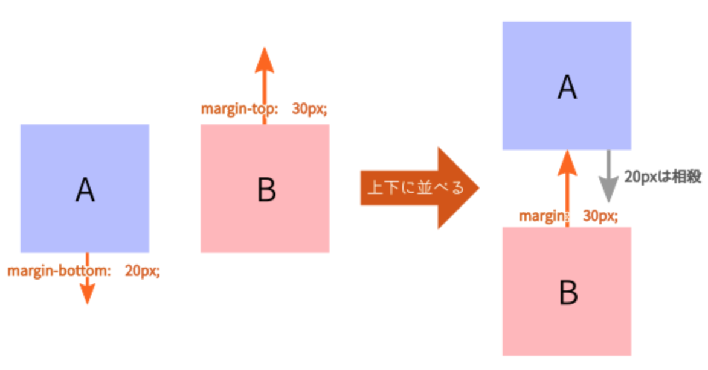

### #03-3. よく使うCSSプロパティの紹介

<p class="-mt36">全てのCSSプロパティをご紹介することできませんので、<br><a href="https://developer.mozilla.org/ja/docs/Web/CSS/CSS_Properties_Reference">一般的なCSSプロパティリファレンス | MDN</a>を見ていただけると分かりやすそうです。また、その中から特徴的なものを抜粋してご説明します。</p>

<a href="../">戻る</a>

---

#### もくじ 📝
- よく使うCSSプロパティ
  - padding, margin
  - position
  - display
    - block
    - inline
    - flex

---

#### padding, margin

余白を表現するCSSプロパティ。

<p class="-mt24">skilltrans-fe_201902_testリポジトリのsrc/sass/module/_testTransfer.scssを使用します。</p>
```shell
npm run dev
```
の実行後、_testTransfer.scssを開いていただけますでしょうか

-- 

##### padding, marginの違い

単純に比較すると下記の違いがあります。
- padding: 要素の内側に余白をつける
- margin: 要素の外側に余白をつける


```css
.inner {
  height: 100px;
  width: 100px;
  background-color: yellow;
  border: 1px solid black;
  // こちらに padding-top: 10px; もしくは margin-top: 10px; を追加してみてください。
}
```
<p class="fragment">paddingとmarginはそれぞれ、もう少し癖がありますので、ご紹介します</p>

--

##### paddingの特徴的なこと

先ほどは、height: 100px; の要素にpadding-top: 10px;を追加したので、<br><span class="-b">高さが110px</span>になりました。  
ですが、<span class="-u">box-sizing: border-box;</span>を適用すると変わります。

```css
.inner {
  padding-top: 10px;
  box-sizing: border-box;
}
```
<p class="-mt36">正方形に戻ったと思います。box-sizing: border-box;とすると、<br><span class="-b">padding, borderも含めて、height: 100pxにする</span>という挙動に変化します。  
レッツのページで散見されたので、念のためご紹介しました。</p>

--

##### marginの特徴的なこと

marginには、<span class="-b">上下の余白は相殺される</span>という特徴があります。


```css
.outer {
  height: 200px;
  width: 200px;
  background-color: aqua;
  border: 1px solid black;
  /* 一度、margin-bottom: 20px; のみ記載してブラウザをご確認ください。 */
  /* その後、margin-top: 20px; も追加して見てください。 */
}
```
この上下余白の相殺は便利なのですが、どの要素同士が上下になるか把握していないと、意図せず潰れて見えることがありますのでご注意ください。

---

#### position
- relative
- absolute


-- 

#### position

.outerの要素の位置を元にして、そこから下に〇〇px, 右に〇〇pxとしたい時に使用します。
```css
.outer {
  position: relative;
}

.inner {
  position: absolute;
  top: 20px;
  left: 20px;
}
```


-- 

#### position

.outerの要素の大きさに関係なく、上下中央にしたい時は下記のように指定します。
```css
.outer {
  position: relative;
}

.inner {
  position: absolute;
  top: 0;
  bottom: 0;
  margin: auto 0;  //上下のmarginをautoにする
}
```

---

#### display

- ①block
- ②inline
- ③flex

--

##### ①display: block;


<div style="background: #999;">デフォルトでdisplay: block;自動的に100%</div>
　
<pre><code><div style="background: #999;">デフォルトでdisplay: block;自動的に100%</div></code></pre>


<p class="-mt24">display: block;が宣言された要素は横幅100%がデフォルトで指定され、padding, marginが使用可能です。
<span class="-b">divやp要素などにデフォルトで指定</span>されています。</p>

--

#### ②display: inline;

<span style="background: #999;">デフォルトでdisplay: inline;</span>
　
<pre><code><span style="background: #999;">デフォルトでdisplay: inline;</span></code></pre>


<p class="-mt24">display: inline;が宣言された要素は横幅は要素の幅になります。
<span class="-b">spanやa要素などにデフォルトで指定</span>されています。</p>

<p class="-mt36">他にもinline-block, table, table-cellなどがあり、<br>それぞれ特徴を持ち、CSSプロパティの適用可否が異なります。  
詳細は<a href="https://saruwakakun.com/html-css/basic/display">こちら</a>が分かりやすいと思います。
</p>

--

#### ③display: flex

レイアウト用ではないのに使用されてきたfloatに代わる新しいボックスレイアウト方法。  
横並びはもちろん、ボックスを均等位置に配置したり、整列や中央揃えなど、柔軟なレイアウトができます。  

<p class="-mt36">IE11, safari, android4.4などで表示崩れが起きる時がありますが、次の記事を参考にすると原因と対処法が見つかると思います。<br><a href="https://qiita.com/hashrock/items/189db03021b0f565ae27">参考：flexboxのバグに立ち向かう</a></p>

--

#### ③display: flex

```html
<ul class="trans__list">
  <li class="trans__item">flexbox</li>
  <li class="trans__item">を</li>
  <li class="trans__item">並べる</li>
</ul>
```

```css
.trans__list {
  display: flex;
}
```
これだけで横に並びます。加えて、下記のプロパティを使用することで、上下左右の余白の調整ができます。  
・justify-content: 要素の左右の調整  
・align-items: 要素の上下の調整

--

#### ③display: flex

```css
.trans__list {
  display: flex;
  justify-content: space-evenly;  
  align-items: center
}
```

左右は均等に、上下は中央に表示されたと思います。  
justify-content, align-itemsの値を変更するだけでも多くのレイアウトに対応できます。  
開発者モード上で、変更して見てください。  
また、検索すると<a href="https://qiita.com/hashrock/items/939684b9207dbab1d59e">レイアウト集</a>がかなり出てきますので、ご確認いただければと思います。

---

#### よく使うCSSプロパティまとめ
- paddingは内側の余白, marginは外側の余白
  - padding, borderは、box-sizing:border-box;に気をつける
  - marginは上下の余白の相殺が生じる。
- postion: relative, absoluteで親子間の位置関係を指定できる
- display: block;の横幅は100%, div, pがデフォルト
- display: inline;の横幅は要素の幅, a, img, spanがデフォルト
- display: flex;はfloatなどに代わる新しいレイアウト方法

