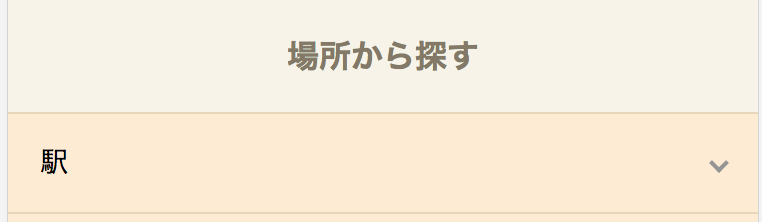
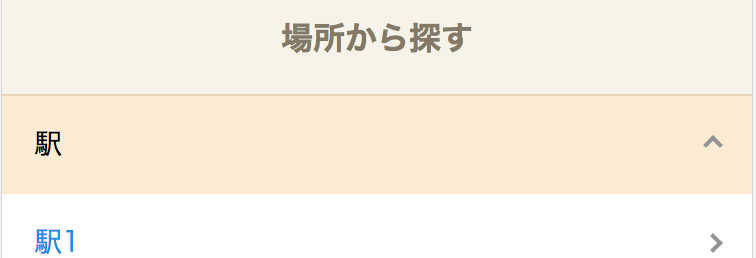

### #03-4. ベンダープレフィックス

<a href="../">戻る</a>

--- 

#### 目次
- ベンダープレフィックスとは
- autoprefixerの対象ブラウザ・OS設定

--- 

#### ベンダープレフィックスとは

-- 

#### ベンダープレフィックスとは

<blockquote class="-small">採用される予定の機能が各ブラウザで先行実装されていますが、それらの機能を動作させるには、 現状ではプロパティや値の先頭に-moz-や-webkit-などのベンダープレフィックスを付ける必要があります。</blockquote>

CSSプロパティによっては、各ブラウザが先行実装していて、各ブラウザごとにプレフィックス（接頭辞）が決まっています。

-- 

#### ベンダープレフィックスとは

例えば、testリポジトリの下部にある「場所から探す」モジュールの  
矢印の下向きから上向きへの変更は、transform: rorate(角度);の値を変更することで実現していますが、  
この<a href="https://caniuse.com/#search=transform">transformをcaniuseで確認</a>してみると...




<p>Android4.4で <span class="-b">Supported with prefix: -webkit-</span> と出ます。<br>実際に開発者モードで確認してみると<span class="-b">-webkit-transform: rotate(135deg);</span>が表示されています。<br>これはautoprefixerモジュールが自動的に入れています。</p>

---

#### autoprefixerの対象ブラウザ・OS設定


--

#### autoprefixerの対象ブラウザ・OS設定

ベンダープレフィックスは、各ブラウザごとに接頭辞が異なり、また、バージョンごとに要・不要が決まっています。  
autoprefixerが自動的にベンダープレフィックスを入れてくれますが、対象のブラウザ情報は設定する必要があります。

```js
var sass = require('gulp-sass');
var autoprefixer = require('gulp-autoprefixer');

gulp.task('sass', function () {
  return gulp.src(path.css_src + '**/*.scss')
    .pipe(sass({ outputStyle: 'compressed' })
    .on('error', sass.logError))
    .pipe(autoprefixer({browsers: ['ie >= 11', 'Android >= 4.4', 'iOS >= 10']}))  //<--
    .pipe(gulp.dest(path.dist + 'css/'));
});
```
このようにStringで不等号を使用するなどして設定します。  
（'last 2 versions', という指定方法もできます。）

---

#### ベンダープレフィックスまとめ
- ベンダープレフィックスは、将来のCSSプロパティを使用するための各ブラウザ独自のCSSプロパティ
- ブラウザ情報を指定すれば、autoprefixerが自動的に追加してくれる。

