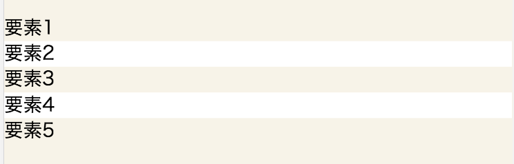
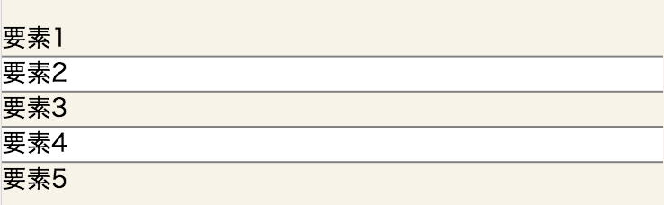
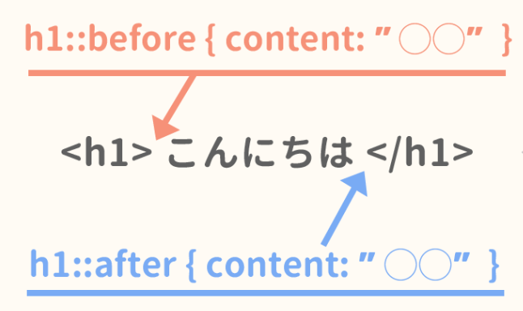

### #03-5. セレクタ

<a href="../">戻る</a>

---

#### もくじ 📝

* セレクタとは
* idセレクタ・classセレクタ・要素型セレクタ
* 擬似クラス
* 擬似要素
* その他のセレクタ

---

#### セレクタとは

-- 

#### セレクタとは

<h5 class="-mb8">html</h5>
```html
<div class="target">色を付けてください</div>
```

<h5 class="-mt24 -mb8">css</h5>
```css
.target {
  color: red;
}
```

<p class="-mt24 -u -b">セレクタ（selector）とはスタイルシートを適用する対象のことです。<br>セレクタはid名、クラス名、HTMLタグ名などで指定できます。次のページから詳しく解説していきます。</p>

---

#### idセレクタ・classセレクタ・要素型

--

#### idセレクタとは？

<h5 class="-mb8">html</h5>
```html
<div id="foo">色を付けてください</div>
```
<h5 class="-mt24 -mb8">css</h5>
```css
/* ドットを最初に記述して、class名を記述する */
#foo {
  color: black;
}
```

idセレクタは、<span class="-b">#idName</span>で指定します。  
id属性自体が1ページにつき１つしか使えないというデメリットも存在するため、あまり使用されることはありません。  
(fooというidは、同じhtml内で使用できない。)

-- 

#### classセレクタとは？

<h5 class="-mb8">html</h5>
```html
<div class="text">色を付けてください</div>
```
<h5 class="-mt24 -mb8">css</h5>
```css
/* ドットを最初に記述して、その後にclass名を記述する */
.text {
  color: green;
}
```

classセレクタは、<span class="-b">.className</span>で指定します。  
理由は後ほどご説明しますが、<b class="-u">CSSは基本的にこのclassセレクタを用いていきます。</b>

--

#### 要素型セレクタとは？

<h5 class="-mb8">html</h5>
```html
<div>色を付けてください</div>
```
<h5 class="-mt24 -mb8">css</h5>
```css
/* 普通にタグ名を記述する */
div {
  color: blue;
}
```

要素型セレクタは、<span class="-b">タグ名</span>で指定します。  
広範囲に影響し、タグが固定なのは汎用性が下がるので、あまり使用しません。

---

#### 擬似クラス

--

#### 擬似クラスとは？

<blockquote class="-small -mb24">疑似クラス（pseudo-classes）とは、 要素や属性などの文書構造だけでは特定できない “ある状況のある要素”を対象としてスタイルを適用するセレクタのことです。 例えば、最初の子要素やユーザーが操作中の要素などを対象にスタイルを適用することが可能になります。 ユーザー操作による状況変化に対してスタイルを適用できるため、ウェブページに動的な効果を与えることが出来ます。</blockquote>
<p class="-align-right"><a href="http://www.htmq.com/csskihon/005.shtml">CSSの基本 セレクタの種類</a></p>
<p class="-mt24" style="text-align:center;"><b class="fragment">「特定の状態にある要素」を指定する、といったイメージとなります</b></p>
--

#### 主な擬似クラス

<table>
  <tr>
    <td>未訪問のリンク</td>
    <td>.hoge<span style="font-weight:bold;">:link</span> {color:blue;}</td>
  </tr>
  <tr>
    <td>訪問済のリンク</td>
    <td>.hoge<span style="font-weight:bold;">:visited</span> {color:blue;}</td>
  </tr>
  <tr>
    <td>カーソルが乗っている要素</td>
    <td>.hoge<span style="font-weight:bold;">:hover</span> {color:blue;}</td></tr>
  <tr>
    <td>クリック中の要素</td>
    <td>.hoge<span style="font-weight:bold;">:active</span> {color:blue;}</td>
  </tr>
  <tr>
    <td>フォーカスされている要素</td>
    <td>.hoge<span style="font-weight:bold;">:focus</span> {background:blue;}</td>
  </tr>
  <tr>
    <td>特定の言語を指定した要素</td>
    <td>.hoge<span style="font-weight:bold;">:lang(en)</span> {color:blue;}</td>
  </tr>
  <tr>
    <td>要素内の最初の子要素</td>
    <td>.hoge<span style="font-weight:bold;">:first-child</span> {color:blue;}</td>
  </tr>
</table>

-- 

#### nth-child(n)、nth-of-type(n)

first-childは、要素内の最初の子要素ですが、<br>nth-of-type(n)で「要素内のn番目の要素」を指定することができます。  
また、nth-of-type(odd)で奇数要素, nth-of-type(even)で偶数要素を指定することができます。  
```html
<ul class="js-list">
  <li class="js-list-item">要素1</li>
  <li class="js-list-item">要素2</li>  <!-- js-list-item:nth-of-type(even) -->
  <li class="js-list-item">要素3</li>
  <li class="js-list-item">要素4</li>  <!-- js-list-item:nth-of-type(even) -->
  <li class="js-list-item">要素5</li>
<ul>
```


他にも、<a href="https://qiita.com/ituki_b/items/62a752389385de7ba4a2">何番目系の便利なCSSまとめ</a>という記事に便利な指定方法が記載されていますので、ご参照ください。

-- 

#### 擬似クラス課題

pseudo__itemクラスに対して、nth-of-typeを使用することで下記の状態を作成してください。  
(要素間にborderを指定していただきたいです。)  
skilltrans-fe_201904_testリポジトリのsrc/sass/module/_testTransfer.scssファイルを編集




---

#### 擬似要素


--

#### 擬似要素とは？

<blockquote class="-small -mb24">擬似要素（pseudo-element）とは、 要素や属性などの文書構造だけでは特定できない “要素の一部”を対象としてスタイルを適用するセレクタのことです。 例えば、要素の一行目や一文字目にスタイルを指定したり、 要素の前後にテキストや画像などを挿入することが出来ます。</blockquote>
<p class="-align-right"><a href="http://www.htmq.com/csskihon/005.shtml">CSSの基本 セレクタの種類</a></p>

--

#### 擬似要素一覧

細かい話ですが、擬似クラスでは、:（コロンが）１つですが、<br>擬似要素は、::（コロン）が2つが推奨されています。(1つでも動作します。)
<table class="-mt24">
  <tr><td>要素の最初の一行</td><td>
  ```
  .hoge::first-line {color:blue;}
  ```
  </td></tr>
  <tr><td>要素の最初の一文字</td><td>
  ```
  .hoge::first-letter {color:blue;}
  ```
  </td></tr>
  <tr><td>要素の直前</td><td>
  ```
  .hoge::before {content:"〇〇";}
  ```
  </td></tr>
  <tr><td>要素の直後</td><td>
  ```
  .hoge::after {content:"〇〇";}
  ```
  </td></tr>
</table>
  
指定した要素の<span class="-b">内側に</span>挿入されます。  
例) <a href="https://pro.gnavi.co.jp/">ぐるなびPRO</a>のスライドショーの遷移ボタン
---

#### その他のセレクタ

--

#### その他のセレクタ一覧

<table class="-small">
<tr><th>名前</th><th>セレクタの書式</th><th>スタイルを適用する対象</th><th>使用例</th></tr>
<tr><th>全称セレクタ</th><td>＊</td><td>すべての要素</td><td>* {color:blue;}</td></tr>
<tr><th rowspan="3">属性セレクタ</th><td>要素名[属性名]</td><td>特定の属性を持つ指定要素</td><td>.hoge[target] {color:blue;}</td></tr>
<tr><td>要素名[属性名= "属性値"]</td><td>特定の属性値を持つ指定要素</td><td>.hoge[target="_blank"] {color:blue;}</td></tr>
<tr><td>要素名[属性名~= "属性値"]</td><td>属性値候補と一致した要素</td><td>.hoge[class~="sample"] {color:blue;}</td></tr>
<tr class="-b"><th>複数のセレクタ</th><td>セレクタ,セレクタ</td><td>複数のセレクタ</td><td>.hoge, .fuga {color:blue;}</td></tr>
<tr><th>子孫セレクタ</th><td>セレクタ セレクタ</td><td>下の階層の子孫要素</td><td>.hoge .fuga {color:blue;}</td></tr>
<tr><th>子セレクタ</th><td>セレクタ&gt;セレクタ</td><td>直下の階層の子要素</td><td>.hoge &gt; .fuga {color:blue;}</td></tr>
<tr class="-b"><th>隣接セレクタ</th><td>セレクタ+セレクタ</td><td>直後に隣接している要素</td><td>.hoge + .fuga {color:blue;}</td></tr>
</table>

---

#### まとめ

* セレクタはスタイルシートを適用する対象のこと
* セレクタはid名, class名, タグ名, 属性名を用いるなど様々な指定方法がある。
