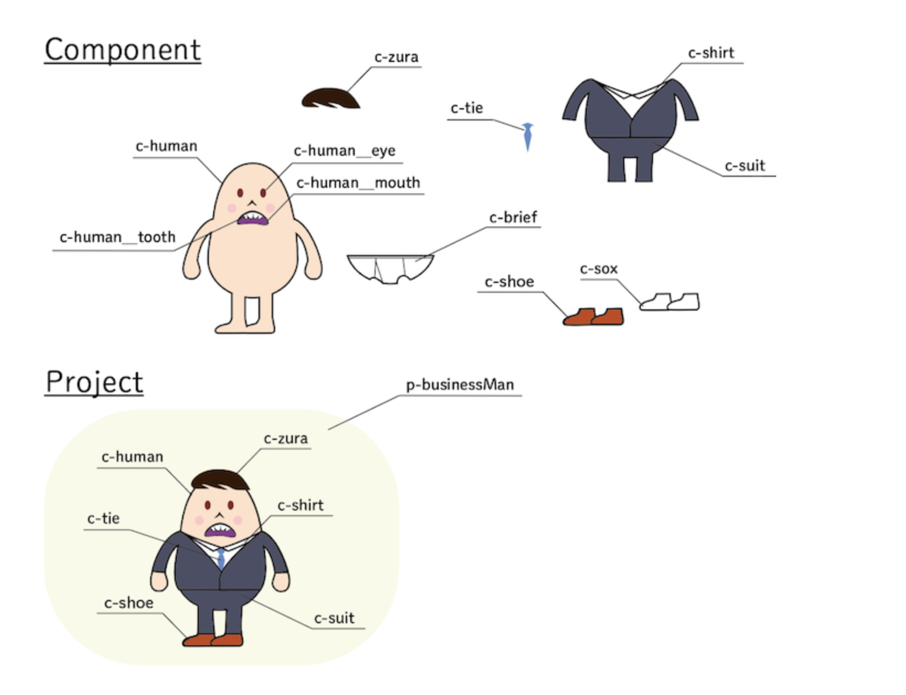

## CSS 設計

<a href="../">戻る</a>

---

#### もくじ

- CSS 設計とは
  - CSS 設計の目的
  - CSS 設計の必要性
- CSS設計の紹介の前に
  - 詳細度の統一
- BEM
  - BEMとは
  - 具体的な BEM の書き方
  - ぐるなびPRO で考える BEM
- 代表的な CSS 設計手法
  - SMACSS
    - SMACSSとは
  - FLOCSS
    - FLOCSS とは
- まとめ

---

## CSS 設計とは
  - CSS 設計の目的
  - CSS 設計の必要性

--

### CSS 設計とは
  - CSS 設計の目的
 
プロジェクト毎に適した CSS 設計を採用することで、「良い CSS※」にすることができます。

<p class="-mt36 -small">※良いCSS = </p>
<ul>
  <li>予測しやすい: <span class="fragment">クラス名を見ただけでなんとなくどんな使い方がされているかわかる</span></li>
  <li>再利用しやすい: <span class="fragment">既存のモジュールから新しいモジュールを簡単に作れる</span></li>
  <li>保守しやすい: <span class="fragment">あるモジュールを追加・更新しても他のモジュールに影響がない</span></li>
  <li>拡張しやすい: <span class="fragment">文字の大きさ違い、色違いなどのパターン違いを容易に作成できる</span></li>
</ul>

--
### CSS 設計とは
  - CSS 設計の必要性

CSS 設計がない状態で、大規模なサイトを複数人で運用していると、<br>予測・再利用・保守・拡張が難しくなり、簡単に思える改修にもコストがかかります。


---

#### CSS設計の紹介の前に
- 詳細度の統一
- BEM（クラス名の命名規則）

-- 

#### CSS設計の紹介の前に
- 詳細度の統一

<p>前章でお話しした、セレクタごとに詳細度（優先度）が違う点は保守性・拡張性などに大きく影響してしまいます。</p>

<p class="-mt24">よって、CSS設計は、classセレクタのみで設計を行なっていくことが多いです。</p>

--

#### CSS設計の紹介の前に
- BEM（クラス名の命名規則）

BEMは、正確に言うと<span class="-b">命名規則</span>です。  
更に、BEMを元にしたMindBEMdingという命名規則のことも含めて、BEMと呼ぶことが多いので、ここでも倣っていきます。


<p class="-mt36">名前にも使用されているように<span class="-b">Block</span>, <span class="-b">Element</span>, <span class="-b">Modifier</span>という概念を元に命名していきます。</p>

-- 

#### CSS設計の紹介の前に
- BEM（クラス名の命名規則）

Webページのモジュールを<span class="-b">Block</span>という単位で扱います。  
また、Blockの中の要素を<span class="-b">Element</span>とします。（ここら辺の粒度は特に決まってません）


<a href="https://app.codegrid.net/entry/bem-basic-1">参考: BEMによるフロントエンドの設計(CodeGrid)</a>

--

### 具体的な BEM の書き方

web サイトによくある<span class="-b">カード</span>型のコンポーネントを BEM を用いて記述してみます。


https://jsbin.com/vihokomevo/3/edit?html,css,output

-- 

### 具体的な BEM の書き方

class名が、block名と<span class="-b">block__element</span>のみで構成されています。  
また、sassの&を使用することで、より効率的にセレクタの指定をしています。

```css
.card__img {
}
```

<br>
また、色違い、文字サイズ違いなどのパターン違いを<span class="-b">Modifier</span>として定義します。  

```css
.card__description--important {

}
```
<br>
このBEMを用いてた上で、チーム内のガイドラインを設けるか、これから紹介するCSS設計手法と組み合わせることが多いです。
-- 

一応、htmlとcssをスライドに貼っておきます。
html
```html
<div class="card">
  <div class="card__img-wrapper">
    
  </div>
  <div class="card__description-wrapper">
    <p class="card__description">
      ここにカードの説明を挿入。ここにカードの説明を挿入。ここにカードの説明を挿入。
    </p>
    <p class="card__description card__description--important">
      ここに重要な説明を挿入。ここに重要な説明を挿入。ここに重要な説明を挿入。
    </p>
  </div>
</div>
```

--

scss は以下のようになります。

```scss
.card {
  width: 240px;
  display: flex;
  flex-direction: column;
  align-items: center;
  border: solid 1px #222;
  padding: 16px;

  &__img-wrapper {
    width: 100%;
    height: 150px;
  }

  &__img {
    width: 100%;
    height: 100%;
    object-fit: cover;
  }

  &__description-wrapper {
    padding-top: 16px;
  }

  &__description {
    color: #444;
    &--important {
      color: #e22;
    }
  }
}
```

BEM を使用することで上記のように、グローバルな名前空間を `card` のみ使用して記述することができました。

--

### ぐるなびPRO で考える BEM


あくまで１例になりますが、ぐるなびPROのモジュールをBEMで実装してみました。  
これで似たものに再利用しやすくなるのではないでしょうか  
https://jsbin.com/nuzibayulu/edit?html,css,output

-- 

html
```html
<article class="articleWrap">
  <h2 class="articleWrap__title">ぐるなびPROとは</h2>
  <p class="articleWrap__desc">繁盛店の秘訣や売上アップのヒントが満載！<br>
    飲食店の開業から経営までサポートする「ぐるなびPRO」ならではの会員特典をご紹介
  </p>
  <ul class="article">
    <li>
      <section class="article__textWrap">
        </img>
        <div>
          <h3 class="article__title">2,000本以上の記事が読める</h3>
          <p class="article__desc">業界の最新トレンド情報からお店を繁盛させるためのノウハウまで、役立つ情報をほぼ毎日配信しています。</p>
        </div>
      <section>
    </li>
  </ul>
</article>
```

--

CSS
```scss
/* ここからreset.cssの代替（仮）です。 */
* {
  margin: 0;
  padding: 0;
  font-family: "游ゴシック", YuGothic, "ヒラギノ角ゴPro W3", "Hiragino Kaku Gothic Pro", "ＭＳ Ｐゴシック", "MS PGothic", "メイリオ", Meiryo, sans-serif;
}

ul, li {
  list-style-type: none;
}

a {
  text-decoration: none;
}

/* ここまでreset.cssの代替（仮）です。 */
/* ここからぐるなびPRO */

.articleWrap {
    margin: 0 auto;
    max-width: 1120px;
    padding: 0 16px;
  
  &__title {
    font-size: 1.8rem;
    font-weight: 700;
    letter-spacing: .02em;
    line-height: 1.66;
    margin-bottom: 24px;
    padding-left: 16px;
    position: relative;
    
    &::before, &::after {
      box-sizing: border-box;
      content: "";
      display: inline-block;
      height: 50%;
      position: absolute;
      left: 0;
      width: 4px;
    }
    
    &::before {
      background-color: #dc0012;
      top: 0;
    }
    
    &::after {
      background-color: #ffbf58;
      bottom: 0;
    }
  }
  
  &__desc {
    font-size: 16px;
    letter-spacing: .02em;
    line-height: 1.75;
  }
}

.article {
  margin-top: 24px;
  
  &__img {
    max-width: 100%
  }
  
  &__textWrap {
    background-color: #f6f4ee;
    padding: 24px 24px 32px;
  }
  
  &__title {
    font-size: 22px;
    margin-bottom: 16px;
    text-align: center;
  }
  
  &__desc {
    font-size: 14px;
    line-height: 1.7;
    letter-spacing: .02em;
    flex: 1 1;
    margin-bottom: 0;
  }
}
```

---

## 代表的な CSS 設計手法
- SMACSS
- FLOCSS

---

## SMACSS

--

### SMACSSとは

SMACSSはCSSを以下の5つにカテゴライズし、命名規則を設定することで、書きやすいCSS環境を目指しています。  

* Base : <span class="-mini">ブラウザスタイルの初期化, ページ全体の背景や基本的なタイポグラフィなど</span>
* Layout : <span class="-mini">ページを構成するヘッダー、メイン、サイドバーなどのページ全体のレイアウトなど</span>
* Module : 再利用できるパーツ
* State : JS制御などによって切り替わる状態を表す
* Theme : 広い範囲でスタイルを変更する

<p class="-mt24">命名</p>

```css
.l-grid{}, .is-active
```

詳しいルールは公式の<a href="http://smacss.com/ja">https://smacss.com/files/smacss-ja.pdf</a>を見た方が良いです。

---

## FLOCSS

--

### FLOCSS とは

<p class="-mb24">３つのレイヤーと、Objectの子レイヤーによって構成されています。</p>
<ul>
  <li>Foundation : <span class="-mini">SMACSSのFoundationと同じく、ブラウザスタイルの初期化, ページ全体の背景や基本的なタイポグラフィなど</span></li>
  <li>Layout : <span class="-mini">SMACSSのLayoutと同じく、ページを構成するヘッダー、メイン、サイドバーなどのページ全体のレイアウトなど</span></li>
  <li>Object 
    <ul>
      <li>Component : <span class="-mini">最小限の機能を持ったものなど</span></li>
      <li>Project <span class="-mini">記事一覧や画像ギャラリーなどコンテンツを構成する具体的な要素など</span></li>
      <li>Utility :<span class="-mini"> 微細なスタイル調整など</span></li>
    </ul>
  </li>
</ul>


<p class="-mt24">命名</p>

```css
.c-dialog{}, .p-comments{}, .u-pt10{}
```
<p>component, project, utilsはクラス名に接頭辞をつけることが推奨されています</p>

--

ComponentとProject



参考: <a href="https://qiita.com/uggds/items/d904b2f9a103c37a25fa">FLOCSSを使ったCSS設計での悩みどころと解決案</a>

-- 

<p class="-mt24">考案者が日本人ということも有り、日本では知名度が高いです。<br>詳しくは<a href="https://github.com/hiloki/flocss">こちら</a>をみてください。</p>

---

CSS設計の詳細に関しては、この緑の本に勝るものはございませんので、ぜひ一読ください。  
フロントエンドの書籍棚にもあります。  


<a href="https://www.amazon.co.jp/Web%E5%88%B6%E4%BD%9C%E8%80%85%E3%81%AE%E3%81%9F%E3%82%81%E3%81%AECSS%E8%A8%AD%E8%A8%88%E3%81%AE%E6%95%99%E7%A7%91%E6%9B%B8-%E3%83%A2%E3%83%80%E3%83%B3Web%E9%96%8B%E7%99%BA%E3%81%AB%E6%AC%A0%E3%81%8B%E3%81%9B%E3%81%AA%E3%81%84%E3%80%8C%E4%BF%AE%E6%AD%A3%E3%81%97%E3%82%84%E3%81%99%E3%81%84CSS%E3%80%8D%E3%81%AE%E8%A8%AD%E8%A8%88%E6%89%8B%E6%B3%95-%E8%B0%B7-%E6%8B%93%E6%A8%B9/dp/4844336355/ref=pd_lpo_sbs_14_img_0?_encoding=UTF8&psc=1&refRID=X7Q9EPWGGJ5M99N8KHMW">Web制作者のためのCSS設計の教科書</a>

---

## まとめ

- CSS 設計は良い CSS を書くためのルールのこと
- 良い CSS = <b>拡張・保守・予測・再利用しやすい CSS</b>のこと
- BEM は命名規則、SMACSS, FLOCSS は設計手法
- 緑本をご一読いただきたいです。
